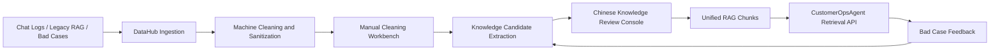

# DataHub | Multi-source Data Governance and RAG Knowledge Platform for Agent Clusters

中文版: [README.md](./README.md)


**Live Demo:**

- Frontend: https://data-hub-flame.vercel.app/
- Backend API: https://datahub-jr8x.onrender.com
- Health Check: https://datahub-jr8x.onrender.com/api/health

> Note: Render free instances may experience cold starts (30-60 seconds on first access). The frontend connects to the backend via the `VITE_API_BASE_URL` environment variable. If the backend is not connected, the frontend displays a friendly status hint instead of a red error.

Current online demo uses the P1 workflow. Import, machine cleaning, manual cleaning, knowledge candidate extraction, knowledge review, RAG build, Agent retrieval, and Bad Case feedback pipelines now support database persistence; the next step is the online persistence smoke test.

DataHub is a data asset center for AI agent systems. It turns customer chat logs, legacy knowledge assets, public evaluation samples, Bad Case corrections, and future multimodal materials into governed, traceable knowledge that can be consumed by agents through restricted APIs.

The current implementation focuses on the text customer-service knowledge loop. It includes local JSON storage, local keyword retrieval, machine cleaning, manual cleaning, Chinese knowledge review, Bad Case feedback, and legacy RAG migration. Multimodal assets, sales-training exports, fine-tuning datasets, and MCP tools are architectural extensions, not production-connected features in this repository.

The frontend is a Chinese dark admin console for data governance operators. It keeps the text customer-service workflow operational while showing future multimodal, dataset reuse, and MCP/Agent-cluster capabilities as roadmap entries only. The console presents the main flow as import -> machine cleaning -> manual cleaning -> knowledge review -> RAG / Agent, and shows friendly backend connection status. The homepage uses a clean Hero section with four capability cards as the unified entry point. API Base URL and backend technical boundaries are not exposed in the public UI.

## Contents

- [Why DataHub](#why-datahub)
- [What DataHub Provides](#what-datahub-provides)
- [Governance Workflow](#governance-workflow)
- [Machine and Manual Cleaning](#machine-and-manual-cleaning)
- [Unified RAG and Agent Access](#unified-rag-and-agent-access)
- [Verified Results](#verified-results)
- [Quick Start](#quick-start)
- [API Examples](#api-examples)
- [Tech Stack](#tech-stack)
- [Safety Boundaries](#safety-boundaries)
- [Test Commands](#test-commands)
- [Roadmap Capabilities](#roadmap-capabilities)
- [Project Layout](#project-layout)

## Why DataHub

For AI customer-service agents, the hardest part is not a single response. The harder problem is maintaining a high-quality knowledge asset: raw conversations contain noise and private data, historical RAG sources are fragmented, Bad Cases are hard to feed back, and human corrections often fail to become reusable knowledge.

DataHub centralizes this process. Agents do not maintain their own knowledge base directly; they retrieve governed knowledge through DataHub.

## What DataHub Provides

DataHub provides a closed loop from raw data governance to agent retrieval:

```text
multi-source data
-> machine cleaning / sanitization / quality scoring
-> manual cleaning / human review
-> knowledge candidates
-> approved candidates
-> local RAG chunks
-> CustomerOpsAgent restricted retrieval
-> Bad Case feedback
-> pending-review draft
```

Implemented text sources include:

- Customer chat JSON imports.
- Public customer-support / e-commerce evaluation samples.
- CustomerOpsAgent legacy RAG exports.
- Bad Case correction drafts.

Architectural extensions include:

- AI Material Center assets.
- OCR / Caption / SKU-bound multimodal knowledge.
- Sales-training and fine-tuning dataset exports.
- MCP tool access for an agent cluster.

## Governance Workflow



## Machine and Manual Cleaning

Machine cleaning adds governance metadata before knowledge extraction:

- PII sanitization: email, phone, order ID, tracking ID, address, name, zip code, payment-sensitive strings.
- Duplicate detection: exact duplicate and near duplicate.
- Low-quality detection: too short, too long, repeated characters, symbol noise, possible garbled text.
- Noise flags: ad-like content, off-topic chatter, weak customer question, weak agent answer.
- Quality governance: `quality_score`, `quality_level`, `suggested_action`.

The Chinese manual cleaning workbench lets cleaners inspect sanitized messages, edit sanitized content, choose keep / keep edited / drop / needs review, and save cleaning notes. Manual cleaning never overwrites raw batches; it updates sanitized messages and writes manual cleaning records.

## Unified RAG and Agent Access

CustomerOpsAgent is expected to retrieve knowledge through DataHub:

```text
POST /api/customer-ops-agent/retrieve
GET  /api/customer-ops-agent/retrievals/{retrieval_id}
```

The local development contract requires:

```text
X-DataHub-Client: CustomerOpsAgent
```

DataHub only returns approved retrieval-ready chunks. It does not expose raw data, sanitized messages, or unapproved candidates to CustomerOpsAgent. Retrieval responses include `retrieval_id`, `score`, `matched_terms`, `chunk_id`, `candidate_id`, and source trace for debugging and Bad Case binding.

## Verified Results

Only verified repository results are listed here:

| Item | Result |
| --- | --- |
| Public dataset sample | 50 conversations / 100 messages |
| candidate_count | 50 |
| approved_count | 10 |
| rag_chunk_count | 10 |
| retrieval_hit_count | 5 |
| bad_case_to_draft_count | 1 |
| P1 flow / public dataset / legacy migration / unified RAG tests | passed |
| advanced cleaning tests | passed |
| manual cleaning / review quality / high-quality release tests | passed |

These results validate the workflow, not production-grade retrieval quality. The current retrieval implementation is still local keyword/mock retrieval.

## Quick Start

Backend:

```powershell
cd D:\Claude_workfile\DataHub
python -m venv .venv
.\.venv\Scripts\Activate.ps1
pip install -r backend\requirements.txt
uvicorn backend.app.main:app --reload
```

Frontend:

```powershell
cd D:\Claude_workfile\DataHub\frontend
npm install
npm run dev
```

Health check:

```powershell
Invoke-RestMethod http://127.0.0.1:8000/health
```

Render deployment guide: [docs/23_RENDER_DEPLOYMENT_GUIDE.md](./docs/23_RENDER_DEPLOYMENT_GUIDE.md)

## API Examples

Import customer chat JSON:

```powershell
$payload = Get-Content .\samples\customer_chat_sample.json -Raw
Invoke-RestMethod `
  -Uri http://127.0.0.1:8000/api/sources/import-json `
  -Method Post `
  -ContentType 'application/json' `
  -Body $payload
```

Run cleaning:

```powershell
Invoke-RestMethod `
  -Uri http://127.0.0.1:8000/api/cleaning/run/{batch_id} `
  -Method Post
```

Save manual cleaning:

```powershell
Invoke-RestMethod `
  -Uri http://127.0.0.1:8000/api/sanitized/{batch_id}/messages/{message_id}/manual-clean `
  -Method Patch `
  -ContentType 'application/json' `
  -Body '{"content":"Manually verified sanitized text","manual_action":"keep_edited","cleaner":"local_cleaner","cleaning_note":"PII checked and business meaning preserved."}'
```

CustomerOpsAgent retrieval:

```powershell
Invoke-RestMethod `
  -Uri http://127.0.0.1:8000/api/customer-ops-agent/retrieve `
  -Method Post `
  -Headers @{"X-DataHub-Client"="CustomerOpsAgent"} `
  -ContentType 'application/json' `
  -Body '{"query":"shipping Germany","top_k":5}'
```

## Tech Stack

- Frontend: React + TypeScript + Vite.
- Backend: FastAPI + Python.
- Current storage: local JSON files.
- Current retrieval: local keyword/mock retrieval.
- Current tests: Python unittest + FastAPI TestClient.

Database, ORM, production vector store, embedding model, real LLM, production auth, and cloud deployment are intentionally left as future technology decisions.

## Safety Boundaries

- Raw batches are read-only and are never overwritten by manual cleaning.
- Unsanitized and unapproved data cannot enter RAG.
- `pending_review`, `needs_revision`, and `rejected` candidates cannot enter retrieval.
- CustomerOpsAgent cannot read raw data, sanitized data, or knowledge candidates directly.
- Bad Cases do not automatically modify candidates or RAG chunks.
- `backend/storage/`, `.env`, `.venv/`, and `node_modules/` are excluded from Git.
- Repository samples must use fake data only.

## Test Commands

```powershell
python -m py_compile backend\app\main.py backend\app\schemas.py backend\app\storage.py
python backend\tests\test_advanced_cleaning.py
python backend\tests\test_manual_cleaning.py
python backend\tests\test_review_quality_console.py
python backend\tests\test_p1_high_quality_datahub_release.py
python backend\tests\test_customerops_retrieval.py
python backend\tests\test_rag_quality.py
python backend\tests\test_bad_case_feedback.py
python backend\tests\test_phase_one_flow.py
python backend\tests\test_public_dataset_eval_flow.py
python backend\tests\test_legacy_rag_migration.py
python backend\tests\test_unified_rag_release.py
```

## Roadmap Capabilities

The full DataHub product shape is agent-cluster oriented:

- AI Material Center: image, video, poster ingestion, OCR, Caption, tags, SKU binding, multimodal review.
- High-quality data reuse: FAQ, SOP, scripts, typical cases, quizzes.
- Fine-tuning dataset export: SFT and preference datasets for brand voice and refusal behavior.
- MCP tools: `search_customer_knowledge`, `submit_bad_case`, `export_training_dataset`, and related tools.
- Agent cluster access: CustomerOpsAgent, SalesAgent, OpsAgent, and MaterialAgent through a unified DataHub entry point.

These are architectural and roadmap capabilities. This repository does not yet connect a real multimodal pipeline, vector database, embedding model, real LLM, production database, or MCP runtime.

## Project Layout

```text
backend/
  app/                 FastAPI API, schemas, local JSON storage services
  tests/               Flow, RAG, Bad Case, legacy migration, manual cleaning tests
frontend/
  src/                 React + TypeScript Chinese admin console
docs/                  PRD, architecture, API contract, acceptance criteria, governance guides
samples/               Safe fake sample data
scripts/               Sample conversion and evaluation helpers
```
