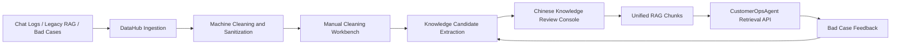

# DataHub | Multi-source Data Governance and RAG Knowledge Platform for Agent Clusters

中文版: [README.md](./README.md)


**Live Demo:**

- Frontend: https://data-hub-flame.vercel.app/
- Backend API: https://datahub-jr8x.onrender.com
- Health Check: https://datahub-jr8x.onrender.com/api/health

> Note: Render free instances may experience cold starts (30-60 seconds on first access). The frontend connects to the backend via the `VITE_API_BASE_URL` environment variable. If the backend is not connected, the frontend displays a friendly status hint instead of a red error. Render currently covers only P1 online acceptance. Without persistent Asset storage, P2 upload safely returns `503 ASSET_STORAGE_UNAVAILABLE`; this must not be described as complete P2 or P3 online availability.

The current online demo supports the P1 workflow. P1 database-backed persistence has passed online smoke testing for import, cleaning, review, RAG, retrieval, and Bad Case feedback. Approved knowledge can be synchronized to the sealed P1 vector RAG table, and CustomerOpsAgent remains on `customerops_vector_retrieval` by default. The formal P1 release is `p1-m24.3-real-embedding-online-release`.

## Current Positioning and Boundaries

DataHub currently contains three implemented centers, but final unified closure of P1 through P3 is not complete:

- **P1 | Customer-service text knowledge governance center**: covers import, cleaning, review, RAG, retrieval, and Bad Case feedback. P1-R2 completed the database-authority cutover: PostgreSQL is the only normal-runtime business authority. Legacy JSON is no longer read, written, merged, or used as a failure fallback; it is retained only as immutable history and explicit migration input.
- **P2 | Material text-projection governance center**: accepts JPEG, PNG, and WebP assets. The formal Extraction path is still deterministic mock and is not real OCR, Caption, or native image understanding. Its current value is asset governance, human revision, Snapshots, publication, an independent Chunk/Embedding index, the Serving Gate, P2-only Retrieval, and explicitly opted-in Unified/CustomerOpsAgent evidence fusion.
- **P3 | Governed-knowledge reuse asset production and delivery center**: produces five asset types—`training_material`, `sop`, `service_script`, `qa_bank`, and `sft_dataset`—from eligible P1, P2, and approved Bad Case sources. It supports deterministic drafts, optional LLM drafts that are disabled by default, manual revision and review, publication, and JSONL/CSV export. `approved` is not `published`; `published` does not mean entry into RAG, an Agent, or training; `export` does not mean model training. P3-M8 is complete, but P3-M9 is incomplete, so P3 is not finally frozen.
- **P4**: has not started.

Local Docker is the current authoritative functional and release-acceptance boundary for P2/P3, not production hardening or complete Render online acceptance. P2/P3 must not be described as fully available online while Render lacks persistent Asset storage. CustomerOpsAgent remains P1-only by default, and Unified requires a versioned API plus explicit opt-in.

## P1-P3-R1 Contract and Infrastructure Hardening

**P1-P3-R1 Contract and Infrastructure Hardening is complete.** R1 froze the P1/P2/P3 product and data-ownership contracts, added read-only `GET /api/capabilities`, established the Alembic baseline, DDL-free startup, Live/Ready separation, production Auth fail-closed behavior, the local Docker migration gate, and four GitHub Actions checks: `backend-unit`, `frontend-quality`, `postgres-integration`, and `contract-safety`. See the [Release Report](docs/86_P1_P3_R1_CONTRACT_INFRASTRUCTURE_RELEASE_REPORT.md) for the full evidence.

Stage E accidentally issued one real SiliconFlow query embedding and persisted one contract-required `retrieval_logs` audit row. The user explicitly accepted this exception; the audit row is retained and the preflight was not rewritten. The other 26 business-table count/hash snapshots, the Schema fingerprints, and the exact seven P3 tables remained unchanged. This exception does not mean that a real Provider business capability has been delivered.

R1 closes only contract and infrastructure hardening. P1 JSON/database dual writes, real P2 OCR/Caption/Vision and cloud storage, P3-M9, OIDC/human identity, and P4 remain incomplete. Local Docker remains authoritative, and green CI is not production deployment acceptance.

The remaining Goals must proceed in this order:

1. ~~P1 single source of truth.~~ **P1-R2 complete.**
2. P2/P3 core gaps.
3. Final unified closure of P1 through P3.

## P1-R2 Database Single Source of Truth

**P1-R2 Database Authority is complete.** The 14-entry Persistence Map covers 10 losslessly reconcilable/migratable entities, three read-only legacy-audit entities, and one DB-only entity. The insert-only backfill added 53,705 valid JSON-only historical records. Final reconciliation is `EXACT_MATCH=53,705`, `JSON_ONLY=0`, `CONFLICT=0`, `ORPHAN=0`, and `INVALID=0`. All 24,961 historical JSON files remain retained, with aggregate SHA-256 unchanged at `4bca2561...f281`; normal runtime neither reads nor modifies them. Database failure now fails closed as safe `503 P1_DATABASE_UNAVAILABLE`. See the [P1-R2 Release Report](docs/87_P1_R2_DATABASE_AUTHORITY_RELEASE_REPORT.md).

## Contents

- [Current Positioning and Boundaries](#current-positioning-and-boundaries)
- [P1-P3-R1 Contract and Infrastructure Hardening](#p1-p3-r1-contract-and-infrastructure-hardening)
- [Why DataHub](#why-datahub)
- [What DataHub Provides](#what-datahub-provides)
- [Governance Workflow](#governance-workflow)
- [Machine and Manual Cleaning](#machine-and-manual-cleaning)
- [Unified RAG and Agent Access](#unified-rag-and-agent-access)
- [Verified Results](#verified-results)
- [Quick Start](#quick-start)
- [API Examples](#api-examples)
- [Tech Stack](#tech-stack)
- [Safety Boundaries](#safety-boundaries)
- [Test Commands](#test-commands)
- [Current Capabilities and Roadmap](#current-capabilities-and-roadmap)
- [Project Layout](#project-layout)

## Why DataHub

For AI customer-service agents, the hardest part is not a single response. The harder problem is maintaining a high-quality knowledge asset: raw conversations contain noise and private data, historical RAG sources are fragmented, Bad Cases are hard to feed back, and human corrections often fail to become reusable knowledge.

DataHub centralizes this process. Agents do not maintain their own knowledge base directly; they retrieve governed knowledge through DataHub.

## What DataHub Provides

DataHub provides a closed loop from raw data governance to agent retrieval:

```text
multi-source data
-> machine cleaning / sanitization / quality scoring
-> manual cleaning / human review
-> knowledge candidates
-> approved candidates
-> local RAG chunks
-> CustomerOpsAgent restricted retrieval
-> Bad Case feedback
-> pending-review draft
```

Implemented text sources include:

- Customer chat JSON imports.
- Public customer-support / e-commerce evaluation samples.
- CustomerOpsAgent legacy RAG exports.
- Bad Case correction drafts.

Architectural extensions include:

- AI Material Center assets.
- OCR / Caption / SKU-bound multimodal knowledge.
- Sales-training and fine-tuning dataset exports.
- MCP tool access for an agent cluster.

## Governance Workflow


```mermaid
flowchart LR
  A["Chat Logs / Legacy RAG / Bad Cases"] --> B["DataHub Ingestion"]
  B --> C["Machine Cleaning and Sanitization"]
  C --> D["Manual Cleaning Workbench"]
  D --> E["Knowledge Candidate Extraction"]
  E --> F["Chinese Knowledge Review Console"]
  F --> G["Unified RAG Chunks"]
  G --> H["CustomerOpsAgent Retrieval API"]
  H --> I["Bad Case Feedback"]
  I --> E
```

## Machine and Manual Cleaning

Machine cleaning adds governance metadata before knowledge extraction:

- PII sanitization: email, phone, order ID, tracking ID, address, name, zip code, payment-sensitive strings.
- Duplicate detection: exact duplicate and near duplicate.
- Low-quality detection: too short, too long, repeated characters, symbol noise, possible garbled text.
- Noise flags: ad-like content, off-topic chatter, weak customer question, weak agent answer.
- Quality governance: `quality_score`, `quality_level`, `suggested_action`.

The Chinese manual cleaning workbench lets cleaners inspect sanitized messages, edit sanitized content, choose keep / keep edited / drop / needs review, and save cleaning notes. Manual cleaning never overwrites raw batches; it updates sanitized messages and writes manual cleaning records.

## Unified RAG and Agent Access

CustomerOpsAgent is expected to retrieve knowledge through DataHub:

```text
POST /api/customer-ops-agent/retrieve
GET  /api/customer-ops-agent/retrievals/{retrieval_id}
```

The local development contract requires:

```text
X-DataHub-Client: CustomerOpsAgent
```

DataHub only returns approved retrieval-ready chunks. It does not expose raw data, sanitized messages, or unapproved candidates to CustomerOpsAgent. Retrieval responses include `retrieval_id`, `score`, `matched_terms`, `chunk_id`, `candidate_id`, and source trace for debugging and Bad Case binding.

## Verified Results

Only verified repository results are listed here:

| Item | Result |
| --- | --- |
| Public dataset sample | 50 conversations / 100 messages |
| candidate_count | 50 |
| approved_count | 10 |
| rag_chunk_count | 10 |
| retrieval_hit_count | 5 |
| bad_case_to_draft_count | 1 |
| P1 flow / public dataset / legacy migration / unified RAG tests | passed |
| advanced cleaning tests | passed |
| manual cleaning / review quality / high-quality release tests | passed |

These legacy sample results validate the workflow, not production-grade retrieval quality. The current retrieval path is semantic vector retrieval first, with keyword retrieval retained as a safe fallback.

## Quick Start

Backend:

```powershell
cd D:\Claude_workfile\DataHub
python -m venv .venv
.\.venv\Scripts\Activate.ps1
pip install -r backend\requirements.txt
uvicorn backend.app.main:app --reload
```

Frontend:

```powershell
cd D:\Claude_workfile\DataHub\frontend
npm install
npm run dev
```

Health check:

```powershell
Invoke-RestMethod http://127.0.0.1:8000/health
```

Render deployment guide: [docs/23_RENDER_DEPLOYMENT_GUIDE.md](./docs/23_RENDER_DEPLOYMENT_GUIDE.md)

Local environment variables:

```bash
cp .env.example .env
```

Then edit `.env` and fill in your API keys (e.g. DeepSeek LLM key). `.env` is never committed to Git.

The template keeps mock as a key-free safe default. The online real-semantic path has been verified with:
```bash
EMBEDDING_PROVIDER=siliconflow   # or jina, openai, openai_compatible
EMBEDDING_API_KEY=your_key
EMBEDDING_BASE_URL=https://api.siliconflow.cn/v1
EMBEDDING_MODEL=Qwen/Qwen3-Embedding-4B
EMBEDDING_DIMENSION=1536
```
Note: `EMBEDDING_DIMENSION` must match the pgvector table schema (currently 1536). DeepSeek is not an embedding provider; its API connectivity is verified independently, while the current retrieval contract does not claim LLM answer generation.

## API Examples

Import customer chat JSON:

```powershell
$payload = Get-Content .\samples\customer_chat_sample.json -Raw
Invoke-RestMethod `
  -Uri http://127.0.0.1:8000/api/sources/import-json `
  -Method Post `
  -ContentType 'application/json' `
  -Body $payload
```

Run cleaning:

```powershell
Invoke-RestMethod `
  -Uri http://127.0.0.1:8000/api/cleaning/run/{batch_id} `
  -Method Post
```

Save manual cleaning:

```powershell
Invoke-RestMethod `
  -Uri http://127.0.0.1:8000/api/sanitized/{batch_id}/messages/{message_id}/manual-clean `
  -Method Patch `
  -ContentType 'application/json' `
  -Body '{"content":"Manually verified sanitized text","manual_action":"keep_edited","cleaner":"local_cleaner","cleaning_note":"PII checked and business meaning preserved."}'
```

CustomerOpsAgent retrieval:

```powershell
Invoke-RestMethod `
  -Uri http://127.0.0.1:8000/api/customer-ops-agent/retrieve `
  -Method Post `
  -Headers @{"X-DataHub-Client"="CustomerOpsAgent"} `
  -ContentType 'application/json' `
  -Body '{"query":"shipping Germany","top_k":5}'
```

## Tech Stack

- Frontend: React + TypeScript + Vite.
- Backend: FastAPI + Python.
- Current persistence: PostgreSQL-first with a local JSON compatibility fallback.
- Current retrieval: semantic vector retrieval first (pgvector cosine similarity), keyword retrieval as fallback.
- Current embedding: SiliconFlow `Qwen/Qwen3-Embedding-4B`, 1536 dimensions, verified through an online rebuild and semantic retrieval checks.
- Current tests: Python unittest + FastAPI TestClient.

Real DeepSeek provider connectivity has been verified, while the current DataHub retrieval contract still returns governed knowledge evidence and does not claim integrated LLM answer generation. Production authentication, observability, and higher-availability deployment remain future hardening work.

## Safety Boundaries

- Raw batches are read-only and are never overwritten by manual cleaning.
- Unsanitized and unapproved data cannot enter RAG.
- `pending_review`, `needs_revision`, and `rejected` candidates cannot enter retrieval.
- CustomerOpsAgent cannot read raw data, sanitized data, or knowledge candidates directly.
- Bad Cases do not automatically modify candidates or RAG chunks.
- `backend/storage/`, `.env`, `.venv/`, and `node_modules/` are excluded from Git.
- Repository samples must use fake data only.

## Test Commands

```powershell
python -m py_compile backend\app\main.py backend\app\schemas.py backend\app\storage.py
python backend\tests\test_advanced_cleaning.py
python backend\tests\test_manual_cleaning.py
python backend\tests\test_review_quality_console.py
python backend\tests\test_p1_high_quality_datahub_release.py
python backend\tests\test_customerops_retrieval.py
python backend\tests\test_rag_quality.py
python backend\tests\test_bad_case_feedback.py
python backend\tests\test_phase_one_flow.py
python backend\tests\test_public_dataset_eval_flow.py
python backend\tests\test_legacy_rag_migration.py
python backend\tests\test_unified_rag_release.py
```

## Current Capabilities and Roadmap

The current repository implements:

- P2 governance for JPEG/PNG/WebP assets, deterministic-mock OCR/Caption/Metadata text projection, human revision, Snapshots, publication, and isolated retrieval.
- P3 production, review, and publication of five governed reuse asset types, plus JSONL/CSV Artifact export. An export is not a training job and does not automatically enter RAG or an Agent.

The following remain architectural or roadmap capabilities:

- Real OCR/Caption/image-understanding providers, native image embeddings, image-to-image retrieval, CLIP, multimodal reranking, and video semantic indexing.
- DataHub-internal final-answer generation, real model training, a Preference-dataset production pipeline, and cloud Artifact delivery.
- MCP tools: `search_customer_knowledge`, `submit_bad_case`, `export_training_dataset`, and related tools.
- Agent cluster access: CustomerOpsAgent, SalesAgent, OpsAgent, and MaterialAgent through a unified DataHub entry point.

This repository does not yet connect a real multimodal pipeline, DataHub-internal LLM answer generation, or an MCP runtime. P3-M9 remains incomplete, and P4 has not started.

## Project Layout

```text
backend/
  app/                 FastAPI API, schemas, local JSON storage services
  tests/               Flow, RAG, Bad Case, legacy migration, manual cleaning tests
frontend/
  src/                 React + TypeScript Chinese admin console
docs/                  PRD, architecture, API contract, acceptance criteria, governance guides
samples/               Safe fake sample data
scripts/               Sample conversion and evaluation helpers
```
