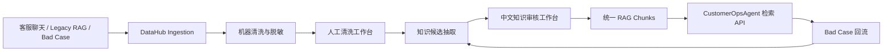

# DataHub｜面向 Agent 集群的多源数据治理与 RAG 知识中台

English version: [README.en.md](./README.en.md)


**在线体验 / Live Demo：**

- 前端 Demo：https://data-hub-flame.vercel.app/
- 后端 API：https://datahub-jr8x.onrender.com
- 健康检查：https://datahub-jr8x.onrender.com/api/health

> 说明：Render 免费实例可能冷启动，首次访问需等待 30-60 秒。前端通过 `VITE_API_BASE_URL` 环境变量连接后端。如果后端未连接，前端会显示友好的状态提示而非红色错误。

当前线上 Demo 已支持 P1 主流程演示。P1 数据库持久化链路已完成线上 smoke test，覆盖导入、清洗、审核、RAG、检索与 Bad Case 回流。Approved knowledge can now be synced into the vector RAG table; semantic retrieval integration is planned next. 最终收版前还将补齐真实向量 RAG 与 CustomerOpsAgent 语义检索闭环。

DataHub 是一个面向 AI Agent 集群的数据资产中心，用来把客服聊天记录、历史知识库、公开评测样本、Bad Case 修正和后续多模态素材统一纳入治理流程，经过清洗、脱敏、人工修正、知识抽取、审核和 RAG 构建后，提供给 CustomerOpsAgent 等 Agent 以受限 API 调用。

当前实现聚焦文本客服知识闭环，并已经具备本地 JSON 存储、本地关键词检索、人工清洗、中文知识审核、Bad Case 回流和 Legacy RAG 迁移能力。前端已经升级为全中文暗黑管理台，用于数据治理人员查看质量标签、执行人工清洗、处理知识审核和管理统一 RAG 入口。管理台以”导入 -> 机器清洗 -> 人工清洗 -> 知识审核 -> RAG / Agent”的主流程组织页面；如果后端未启动，页面会显示友好的连接状态提示。首页入口已简化为 Hero 介绍区加四个能力模块卡片，用户通过卡片直接进入对应工作区。公开前端不展示 API Base URL 和后端技术边界。多模态素材中心、销售培训数据导出、微调数据集导出和 MCP Tools 属于架构预留能力，尚未作为生产功能接入。

## 目录

- [为什么做](#为什么做)
- [DataHub 做什么](#datahub-做什么)
- [核心工作流](#核心工作流)
- [机器清洗与人工清洗](#机器清洗与人工清洗)
- [统一 RAG 与 Agent 调用](#统一-rag-与-agent-调用)
- [质量验证结果](#质量验证结果)
- [快速开始](#快速开始)
- [API 示例](#api-示例)
- [技术栈](#技术栈)
- [安全边界](#安全边界)
- [测试命令](#测试命令)
- [架构预留能力](#架构预留能力)
- [项目目录](#项目目录)

## 为什么做

AI 客服和 Agent 项目最难持续优化的部分不是单次回答，而是知识资产本身：原始聊天记录质量参差不齐，隐私字段不能直接进入 RAG，历史知识库来源不统一，Bad Case 难以回流，人工修正后的高质量数据也缺少统一沉淀位置。

DataHub 的目标是把这些分散数据收拢成可追溯、可审核、可复用的知识资产，让 Agent 不直接维护知识库，而是通过 DataHub 统一检索。

## DataHub 做什么

DataHub 提供一条从数据治理到 Agent 调用的闭环：

```text
多源数据
-> 机器清洗 / 脱敏 / 质量评分
-> 人工清洗 / 人工审核
-> knowledge candidates
-> approved candidates
-> local RAG chunks
-> CustomerOpsAgent restricted retrieval
-> Bad Case feedback
-> pending-review draft
```

已接入的文本来源包括：

- 客服聊天 JSON 导入。
- 公开客服/电商样本评测数据。
- CustomerOpsAgent legacy RAG export。
- Bad Case 人工修正草稿。

架构预留来源包括：

- AI 素材中心图片、视频、海报。
- OCR / Caption / SKU 绑定后的多模态知识。
- 销售培训资料与微调数据集。
- MCP Tools 形式的 Agent 集群统一调用。

## 核心工作流



## 机器清洗与人工清洗

机器清洗负责在进入知识抽取前给每条消息打上治理标签：

- PII 脱敏：邮箱、电话、订单号、物流单号、地址、姓名、邮编、支付敏感串。
- 重复检测：完全重复、近似重复。
- 低质量识别：过短、过长、重复字符、符号噪声、疑似乱码。
- 噪声标记：广告、无关闲聊、偏离客服场景文本。
- 质量评分：`quality_score`、`quality_level`、`suggested_action`。

人工清洗工作台提供中文管理界面，清洗人员可以查看机器清洗结果、编辑 sanitized content、选择保留/修改后保留/丢弃/需要复核，并记录清洗备注。人工清洗不会覆盖 raw batch，只会写入 sanitized batch 和 manual cleaning record。

## 统一 RAG 与 Agent 调用

CustomerOpsAgent 后续推荐只通过 DataHub 调用知识：

```text
POST /api/customer-ops-agent/retrieve
GET  /api/customer-ops-agent/retrievals/{retrieval_id}
```

调用需要本地开发阶段的客户端头：

```text
X-DataHub-Client: CustomerOpsAgent
```

DataHub 只返回 approved 且已构建为 retrieval-ready chunk 的知识，不暴露 raw data、sanitized data 或未审核候选知识。返回结果包含 `retrieval_id`、`score`、`matched_terms`、`chunk_id`、`candidate_id` 和 source trace，便于后续 Bad Case 绑定和质量追踪。

## 质量验证结果

已验证指标只记录仓库内测试和评测报告中实际完成的结果：

| 项目 | 结果 |
| --- | --- |
| 公开数据小样本 | 50 conversations / 100 messages |
| candidate_count | 50 |
| approved_count | 10 |
| rag_chunk_count | 10 |
| retrieval_hit_count | 5 |
| bad_case_to_draft_count | 1 |
| P1 flow / public dataset / legacy migration / unified RAG tests | passed |
| advanced cleaning tests | passed |
| manual cleaning / review quality / high-quality release tests | passed |

这些结果证明 DataHub 的治理链路可跑通，但当前检索仍是 local keyword/mock retrieval，不代表生产级向量检索质量。

## 快速开始

后端：

```powershell
cd D:\Claude_workfile\DataHub
python -m venv .venv
.\.venv\Scripts\Activate.ps1
pip install -r backend\requirements.txt
uvicorn backend.app.main:app --reload
```

前端：

```powershell
cd D:\Claude_workfile\DataHub\frontend
npm install
npm run dev
```

健康检查：

```powershell
Invoke-RestMethod http://127.0.0.1:8000/health
```

Render 部署指南：[docs/23_RENDER_DEPLOYMENT_GUIDE.md](./docs/23_RENDER_DEPLOYMENT_GUIDE.md)

## API 示例

导入客服聊天 JSON：

```powershell
$payload = Get-Content .\samples\customer_chat_sample.json -Raw
Invoke-RestMethod `
  -Uri http://127.0.0.1:8000/api/sources/import-json `
  -Method Post `
  -ContentType 'application/json' `
  -Body $payload
```

执行清洗：

```powershell
Invoke-RestMethod `
  -Uri http://127.0.0.1:8000/api/cleaning/run/{batch_id} `
  -Method Post
```

保存人工清洗结果：

```powershell
Invoke-RestMethod `
  -Uri http://127.0.0.1:8000/api/sanitized/{batch_id}/messages/{message_id}/manual-clean `
  -Method Patch `
  -ContentType 'application/json' `
  -Body '{"content":"已人工确认的脱敏文本","manual_action":"keep_edited","cleaner":"local_cleaner","cleaning_note":"已确认业务含义不变。"}'
```

CustomerOpsAgent 检索：

```powershell
Invoke-RestMethod `
  -Uri http://127.0.0.1:8000/api/customer-ops-agent/retrieve `
  -Method Post `
  -Headers @{"X-DataHub-Client"="CustomerOpsAgent"} `
  -ContentType 'application/json' `
  -Body '{"query":"shipping Germany","top_k":5}'
```

## 技术栈

- 前端：React + TypeScript + Vite。
- 后端：FastAPI + Python。
- 当前存储：本地 JSON 文件。
- 当前检索：本地关键词 / mock retrieval。
- 当前测试：Python unittest + FastAPI TestClient。

数据库、ORM、真实向量库、embedding、真实 LLM、生产鉴权和云部署仍保留为后续技术决策，不在当前实现中强行绑定。

## 安全边界

- raw batch 只读，不被人工清洗覆盖。
- 未脱敏、未审核数据不能进入 RAG。
- pending_review / needs_revision / rejected 不能进入 retrieval。
- CustomerOpsAgent 不能直接读取 raw、sanitized 或 knowledge_candidates。
- Bad Case 不会自动修改 candidate 或 RAG chunk。
- `backend/storage/`、`.env`、`.venv/`、`node_modules/` 不提交 Git。
- 仓库内样例必须使用假数据，不提交真实客服隐私、API Key、token 或密码。

## 测试命令

```powershell
python -m py_compile backend\app\main.py backend\app\schemas.py backend\app\storage.py
python backend\tests\test_advanced_cleaning.py
python backend\tests\test_manual_cleaning.py
python backend\tests\test_review_quality_console.py
python backend\tests\test_p1_high_quality_datahub_release.py
python backend\tests\test_customerops_retrieval.py
python backend\tests\test_rag_quality.py
python backend\tests\test_bad_case_feedback.py
python backend\tests\test_phase_one_flow.py
python backend\tests\test_public_dataset_eval_flow.py
python backend\tests\test_legacy_rag_migration.py
python backend\tests\test_unified_rag_release.py
```

## 架构预留能力

DataHub 的完整产品形态面向 Agent 集群：

- AI 素材中心：图片、视频、海报素材导入、OCR、Caption、标签、SKU 绑定与多模态审核。
- 高质量数据复用：FAQ、SOP、话术手册、典型案例、测验题。
- 微调数据导出：SFT / Preference 数据集，服务品牌语气、客服风格和拒答规范优化。
- MCP Tools：`search_customer_knowledge`、`submit_bad_case`、`export_training_dataset` 等工具接口。
- Agent 集群调用：CustomerOpsAgent、SalesAgent、OpsAgent、MaterialAgent 通过统一入口调用 DataHub。

以上属于架构支持和 Roadmap 能力，当前仓库没有接入真实多模态、真实向量库、真实 LLM、真实数据库或 MCP 运行层。

## 项目目录

```text
backend/
  app/                 FastAPI API、schema、local JSON storage service
  tests/               P1 flow、RAG、Bad Case、legacy migration、manual cleaning tests
frontend/
  src/                 React + TypeScript 中文管理台
docs/                  PRD、架构、API 契约、验收标准和治理规则
samples/               安全假数据样例
scripts/               小样本转换与评测辅助脚本
```
