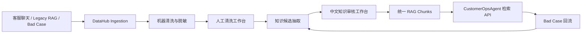

# DataHub｜面向 Agent 集群的多源数据治理与 RAG 知识中台

English version: [README.en.md](./README.en.md)


**在线体验 / Live Demo：**

- 前端 Demo：https://data-hub-flame.vercel.app/
- 后端 API：https://datahub-jr8x.onrender.com
- 健康检查：https://datahub-jr8x.onrender.com/api/health

> 说明：Render 免费实例可能冷启动，首次访问需等待 30-60 秒。前端通过 `VITE_API_BASE_URL` 环境变量连接后端。如果后端未连接，前端会显示友好的状态提示而非红色错误。当前 Render 只完成 P1 线上验收；由于没有可用 Persistent Disk，P2 素材上传会安全返回 `503 ASSET_STORAGE_UNAVAILABLE`，不能据此宣称 P2 已完成 Render 线上验收。

当前线上 Demo 已支持 P1 主流程演示。P1 数据库持久化链路已完成线上 smoke test，覆盖导入、清洗、审核、RAG、检索与 Bad Case 回流。Approved knowledge can be synced into the sealed P1 vector RAG table，CustomerOpsAgent 默认保持 `customerops_vector_retrieval`。P1 正式版本为 `p1-m24.3-real-embedding-online-release`。

DataHub 是一个面向 AI Agent 集群的数据资产中心。P1 治理客服文本知识；P2 将图片、商品素材及其 OCR、Caption、Metadata 文本投影治理为可追溯的知识资产。两者使用独立物理索引，P1 合约保持封板；版本化 Unified Retrieval 只在逻辑查询层通过 rank-only RRF 融合证据。

当前实现包含 P1 文本治理闭环，以及 P2 的 Asset、Extraction、Human Review、Snapshot、Knowledge Asset、独立 Chunk/Embedding、显式 Serving Gate、P2-only Retrieval、Unified Shadow/RRF 和默认关闭的 CustomerOpsAgent 显式 opt-in。P2 的“多模态”边界是 OCR、Caption、Metadata 的文本桥接；原生图片向量、CLIP、多模态 reranker、S3/R2 Adapter 和 Render Persistent Disk 均为延期项。前端保持全中文暗色管理台，不把本地 Docker 验收描述为 Render 线上验收。

当前封板目标为 `p2-m9-local-docker-release`：它表示本地 Docker Release Closure，不表示 Render online release。CustomerOpsAgent 默认仍为 P1-only；Unified 只能通过版本化接口和显式 opt-in 使用。

## 目录

- [为什么做](#为什么做)
- [DataHub 做什么](#datahub-做什么)
- [核心工作流](#核心工作流)
- [机器清洗与人工清洗](#机器清洗与人工清洗)
- [统一 RAG 与 Agent 调用](#统一-rag-与-agent-调用)
- [质量验证结果](#质量验证结果)
- [Docker 快速部署](#docker-快速部署)
- [快速开始](#快速开始)
- [API 示例](#api-示例)
- [技术栈](#技术栈)
- [安全边界](#安全边界)
- [测试命令](#测试命令)
- [架构预留能力](#架构预留能力)
- [项目目录](#项目目录)

## 为什么做

AI 客服和 Agent 项目最难持续优化的部分不是单次回答，而是知识资产本身：原始聊天记录质量参差不齐，隐私字段不能直接进入 RAG，历史知识库来源不统一，Bad Case 难以回流，人工修正后的高质量数据也缺少统一沉淀位置。

DataHub 的目标是把这些分散数据收拢成可追溯、可审核、可复用的知识资产，让 Agent 不直接维护知识库，而是通过 DataHub 统一检索。

## DataHub 做什么

DataHub 提供一条从数据治理到 Agent 调用的闭环：

```text
多源数据
-> 机器清洗 / 脱敏 / 质量评分
-> 人工清洗 / 人工审核
-> knowledge candidates
-> approved candidates
-> local RAG chunks
-> CustomerOpsAgent restricted retrieval
-> Bad Case feedback
-> pending-review draft
```

P2 的治理链路与 P1 物理隔离：

```text
Asset
-> Extraction (OCR / Caption / Metadata 文本桥接)
-> Human Review
-> approved Snapshot
-> active Knowledge Asset
-> P2 Chunk / Embedding
-> explicit Serve
-> P2-only Retrieval
```

`rag_chunks` / `rag_embeddings` 属于封板的 P1；`p2_knowledge_chunks` / `p2_knowledge_embeddings` 属于 P2。P2 不把内容写回 P1 索引，归档或被版本替代的 P2 内容在查询门禁处保持零召回。

已接入的文本来源包括：

- 客服聊天 JSON 导入。
- 公开客服/电商样本评测数据。
- CustomerOpsAgent legacy RAG export。
- Bad Case 人工修正草稿。

P2 已治理的素材知识来源包括：

- AI 素材中心的图片和商品素材。
- 经人工审核的 OCR / Caption / Metadata / SKU 关联文本。

后续延期来源包括：

- 原生图片 embedding、image-to-image retrieval、CLIP 与多模态 reranker。
- 视频语义索引和大规模异步索引集群。
- 销售培训资料与微调数据集。
- MCP Tools 形式的 Agent 集群统一调用。

## 核心工作流



## 机器清洗与人工清洗

机器清洗负责在进入知识抽取前给每条消息打上治理标签：

- PII 脱敏：邮箱、电话、订单号、物流单号、地址、姓名、邮编、支付敏感串。
- 重复检测：完全重复、近似重复。
- 低质量识别：过短、过长、重复字符、符号噪声、疑似乱码。
- 噪声标记：广告、无关闲聊、偏离客服场景文本。
- 质量评分：`quality_score`、`quality_level`、`suggested_action`。

人工清洗工作台提供中文管理界面，清洗人员可以查看机器清洗结果、编辑 sanitized content、选择保留/修改后保留/丢弃/需要复核，并记录清洗备注。人工清洗不会覆盖 raw batch，只会写入 sanitized batch 和 manual cleaning record。

## 统一 RAG 与 Agent 调用

CustomerOpsAgent 后续推荐只通过 DataHub 调用知识：

```text
POST /api/customer-ops-agent/retrieve
GET  /api/customer-ops-agent/retrievals/{retrieval_id}
```

调用需要本地开发阶段的客户端头：

```text
X-DataHub-Client: CustomerOpsAgent
```

DataHub 只返回 approved 且已构建为 retrieval-ready chunk 的知识，不暴露 raw data、sanitized data 或未审核候选知识。返回结果包含 `retrieval_id`、`score`、`matched_terms`、`chunk_id`、`candidate_id` 和 source trace，便于后续 Bad Case 绑定和质量追踪。

## 质量验证结果

已验证指标只记录仓库内测试和评测报告中实际完成的结果：

| 项目 | 结果 |
| --- | --- |
| 公开数据小样本 | 50 conversations / 100 messages |
| candidate_count | 50 |
| approved_count | 10 |
| rag_chunk_count | 10 |
| retrieval_hit_count | 5 |
| bad_case_to_draft_count | 1 |
| P1 flow / public dataset / legacy migration / unified RAG tests | passed |
| advanced cleaning tests | passed |
| manual cleaning / review quality / high-quality release tests | passed |

这些结果证明 DataHub 的治理链路可跑通。当前线上检索已使用 SiliconFlow `Qwen/Qwen3-Embedding-4B` 的 1536 维真实 embedding 与 PostgreSQL/pgvector；关键词检索仍作为安全 fallback。

## Docker 快速部署

Docker Compose 是当前 P2 的权威本地开发与部署验收方式。它提供 PostgreSQL/pgvector、数据库初始化、FastAPI 后端、React 前端，以及独立持久化的数据库和素材卷。宿主机不需要固定的 D 盘路径，也不需要预装 PostgreSQL 或 Node.js。

### 前置要求

- Git。
- Docker Desktop（Windows/macOS）或 Docker Engine + Compose v2（Linux）。
- 建议至少 4 GB 可用内存。
- 只有运行仓库脚本时才需要宿主机 Python 3.11+；服务本身都在容器中。

确认环境：

```bash
docker --version
docker compose version
```

### Clone 后快速启动

```bash
git clone https://github.com/Strange-Men/DataHub.git DataHub
cd DataHub
cp .env.example .env
```

Windows PowerShell 可使用：

```powershell
Copy-Item .env.example .env
```

打开 `.env`，至少为 `POSTGRES_PASSWORD` 设置一个仅用于本地开发的强密码。Compose 使用以下变量：

| 变量 | 必需性 | 安全默认/说明 |
|---|---|---|
| `POSTGRES_DB` | 必需 | 默认 `datahub` |
| `POSTGRES_USER` | 必需 | 默认 `datahub` |
| `POSTGRES_PASSWORD` | 必需 | 模板留空，Compose 会拒绝启动；在本地 `.env` 填写且不要提交 |
| `POSTGRES_PORT` | 可选 | 默认映射宿主机 `5433`，避开常见的本机 5432 |
| `BACKEND_PORT` | 可选 | 默认 `8000` |
| `FRONTEND_PORT` | 可选 | 默认 `5173` |
| `VITE_API_BASE_URL` | 可选 | 浏览器可访问的后端地址，默认 `http://localhost:8000` |
| `ASSET_MAX_UPLOAD_BYTES` | 可选 | 默认 10 MiB |
| `DATAHUB_AUTH_MODE` | 可选 | `disabled` 保持受信本地兼容；暴露的 Docker 环境建议设为 `token` |
| `DATAHUB_*_TOKEN` | token 模式至少一个 | admin/cleaner/reviewer/service/viewer 的互异运行时 Token；缺失角色不可用 |

`POSTGRES_PASSWORD` 支持 URL 保留字符；后端容器入口会在构造 `DATABASE_URL` 时执行 URL 编码。若密码包含 Compose dotenv 的特殊字符，仍需遵守其引用与转义规则。`DATABASE_URL`、容器内 Asset 路径和服务名由 Compose 在容器网络内组装。不要把宿主机路径（例如 `D:/...`）写入 Docker 配置。`VITE_API_BASE_URL` 会进入浏览器构建产物，因此只能放公开 API 地址，不能放密钥。

### 治理认证与角色 Token

M9.2 提供最小的环境变量 Bearer Token + RBAC。`DATAHUB_AUTH_MODE=disabled` 是受信本地和兼容测试的显式模式；需要限制治理 API 的 Docker 部署应使用：

```text
DATAHUB_AUTH_MODE=token
DATAHUB_ADMIN_TOKEN=<unique-runtime-secret>
DATAHUB_CLEANER_TOKEN=<unique-runtime-secret>
DATAHUB_REVIEWER_TOKEN=<unique-runtime-secret>
DATAHUB_SERVICE_TOKEN=<unique-runtime-secret>
DATAHUB_VIEWER_TOKEN=<unique-runtime-secret>
```

Token 只写入未提交的 `.env` 或部署平台 Secret。token 模式至少需要一个角色 Token，不同角色不得复用同一值；未配置的角色不可用且只记录角色名告警，不记录 Token。服务不会生成默认 Token。Health、OpenAPI 和 docs 保持公开；治理、检索与 Agent API 按角色检查权限。

| 角色 | 主要范围 |
|---|---|
| admin | 全部治理、审核、发布、索引、Embed、Serve、Archive |
| cleaner | P1 导入/清洗/修订；P2 上传/Extraction/修订；治理只读 |
| reviewer | P1/P2 待审核查看与审核；Snapshot/Source Trace 只读 |
| service | P1/P2/Unified Retrieval、CustomerOpsAgent、Bad Case 提交 |
| viewer | P1/P2 列表、详情、状态和 P1/P2 Retrieval；无写入 |

启动或切换配置后只需重建 backend，不需要删除 volume：

```bash
docker compose up -d --build backend
```

curl 从环境变量读取 Token，不要把真实值写进脚本或 URL：

```bash
curl -H "Authorization: Bearer $DATAHUB_SERVICE_TOKEN" \
  -H "Content-Type: application/json" \
  -d '{"query":"shipping Germany","top_k":5}' \
  http://localhost:8000/api/rag/search
```

P1/P2 验收脚本同样只接受 Token 所在的环境变量名：

```bash
python scripts/run_p1_pipeline_harness.py --auth-token-env DATAHUB_ADMIN_TOKEN
python scripts/run_p2_local_acceptance.py --auth-token-env DATAHUB_ADMIN_TOKEN
```

前端“访问令牌”仅保存在当前标签页的 `sessionStorage`，角色不在浏览器持久化；应用 Token 和页面刷新时均通过 `/api/auth/me` 获取服务端确认的角色。清除后不再发送 Authorization Header。HTTP 401 表示 Token 缺失或无效；HTTP 403 表示 Token 有效但角色权限不足。排查时检查 `DATAHUB_AUTH_MODE`、目标角色是否配置、Token 是否重复以及调用是否使用 `Authorization: Bearer ...`，不要把 Token 打入日志。

### 中文治理工作台

前端主导航按任务收敛为“P1 文本知识治理”“P2 多模态知识治理”“检索验证”“系统状态”。当前角色只来自 `/api/auth/me`；无权限按钮会禁用并说明原因，后端 RBAC 仍是最终安全边界。

- P1：导入 → 机器清洗 → 手工修订 → 候选知识 → 审核 → RAG 同步 → CustomerOpsAgent → Bad Case。
- P2：上传 → Extraction → Review → Snapshot → 发布 → Index → Embed → Ready → Serve → Retrieval → Archive → Source Trace。
- `ready · 向量已生成，尚未开放检索` 与 `serving · 已开放检索` 明确分开；Serve、Archive、Reject、RAG sync 和版本替换会说明影响并二次确认。
- 检索验证页调用真实 P1/P2/Unified/CustomerOpsAgent API。CustomerOpsAgent 默认 P1-only，Unified 必须显式 opt-in。
- P3/P4 只显示“尚未开放”和原因，入口 disabled，不提供预览式假操作。

校验并启动：

```bash
docker compose config --quiet
docker compose up -d --build
docker compose ps
```

使用 `--quiet` 只校验配置，不把展开后的环境变量或秘密打印到终端、CI 日志或验收报告。

启动顺序由健康门禁控制：`postgres` 健康后运行一次性 `volume-init` / `db-init`，完成 pgvector 和数据库表初始化，再启动 `backend`；`frontend` 等待后端健康。首次启动无需手工建表。如需单独重跑初始化：

```bash
docker compose run --rm volume-init
docker compose run --rm db-init
```

### Mock 与真实 SiliconFlow

`.env.example` 默认使用：

```text
EMBEDDING_PROVIDER=mock
EMBEDDING_MODEL=mock-deterministic
EMBEDDING_DIMENSION=1536
```

Mock 模式无外部密钥即可启动、浏览 UI 和验证基础 API，但**不能**作为真实语义检索、P2 Eval 或发布验收证据。真实验收需要在本地 `.env` 配置：

```text
EMBEDDING_PROVIDER=siliconflow
EMBEDDING_BASE_URL=https://api.siliconflow.cn/v1
EMBEDDING_API_KEY=<your-local-key>
EMBEDDING_MODEL=Qwen/Qwen3-Embedding-4B
EMBEDDING_DIMENSION=1536
P2_EMBEDDING_PROFILE=text_bridge:siliconflow:Qwen/Qwen3-Embedding-4B:1536
```

修改 provider 配置后重建后端：

```bash
docker compose up -d --build backend
```

不要在命令行日志、Issue、截图或提交中暴露 `EMBEDDING_API_KEY`。Mock 和真实 provider 的 Embedding 不应混作同一发布证据。

### 服务地址与健康检查

- 前端：`http://localhost:5173`
- 后端 API：`http://localhost:8000`
- OpenAPI：`http://localhost:8000/docs`
- PostgreSQL：`127.0.0.1:5433`（仅本地调试；容器间使用 `postgres:5432`）

如修改 `FRONTEND_PORT`，Compose 会把对应浏览器 Origin 同步给后端 CORS 配置；如同时修改 `BACKEND_PORT`，仍需把 `VITE_API_BASE_URL` 改成浏览器实际可访问的后端地址并重建前端。

```bash
curl http://localhost:8000/api/health
curl -I http://localhost:5173
docker compose exec postgres sh -c 'psql -U "$POSTGRES_USER" -d "$POSTGRES_DB" -c "SELECT extversion FROM pg_extension WHERE extname = '\''vector'\'';"'
```

后端健康结果应显示 PostgreSQL 可连接和 pgvector 可用。`docker compose ps` 中 `postgres`、`backend`、`frontend` 应为 healthy；`volume-init` 与 `db-init` 成功退出是正常状态。

### 上传素材

准备一张允许提交给本地开发环境的图片，然后调用公开 API：

```bash
curl -X POST http://localhost:8000/api/assets/upload \
  -F "file=@/path/to/material.png"
```

返回结果应包含 Asset ID。二进制保存在 Docker Asset named volume 中，数据库只保存 URI、哈希和元数据，不保存文件二进制。`ASSET_STORAGE_UNAVAILABLE` 通常表示 Asset 卷、初始化服务或 `ASSET_STORAGE_ROOT` 配置异常；先查看 `volume-init` 和 `backend` 日志，不要改用容器临时目录掩盖问题。

### P2 完整验收和 Eval

真实 P2 验收要求 `.env` 已配置 SiliconFlow。以下脚本只通过公开 API 执行 Asset -> Extraction -> Review -> Snapshot -> Knowledge Asset -> Index -> Embedding -> Ready -> Serve -> Retrieval -> Archive -> Zero Recall，并把动态预期 ID 写入持久化且不进入 Git 的 runtime volume。优先直接在后端容器中运行，避免宿主机 Python 依赖差异：

```bash
docker compose exec backend python scripts/run_p2_local_acceptance.py \
  --base-url http://127.0.0.1:8000 \
  --timeout 120 \
  --verbose \
  --run-id p2-local-20260717-run-001 \
  --keep-data \
  --output-manifest /app/.local-data/p2-local-20260717-run-001.json

docker compose exec backend python scripts/run_p2_rag_eval.py \
  --base-url http://127.0.0.1:8000 \
  --top-k 5 \
  --timeout 120 \
  --verbose \
  --expected-manifest /app/.local-data/p2-local-20260717-run-001.json
```

需要从宿主机运行时，可使用 Python 3.11+ 与被 Git 忽略的 `.local-data/`：

```bash
python scripts/run_p2_local_acceptance.py \
  --base-url http://127.0.0.1:8000 \
  --timeout 120 \
  --verbose \
  --run-id p2-local-20260717-run-001 \
  --keep-data \
  --output-manifest .local-data/p2-local-20260717-run-001.json

python scripts/run_p2_rag_eval.py \
  --base-url http://127.0.0.1:8000 \
  --top-k 5 \
  --timeout 120 \
  --verbose \
  --expected-manifest .local-data/p2-local-20260717-run-001.json
```

M9.1 manifest 会记录 `run_id`、`datahub-eval:<run_id>` namespace、trace 和当前 run 的精确 ID。提供 scoped manifest 时，P2/Unified Eval 只计算当前 run 的 P2 结果；P1 control 保持不变。旧 manifest 仍按历史全局 corpus 模式运行；需要显式负对照时可增加 `--no-run-scope-isolation`，不要为改善 Eval 指标修改 RRF 或生产排名。

Eval 完成后可按 manifest 逻辑归档本次测试 Knowledge Asset：

```bash
docker compose exec backend python scripts/run_p2_local_acceptance.py \
  --base-url http://127.0.0.1:8000 \
  --timeout 120 \
  --cleanup-manifest /app/.local-data/p2-local-20260717-run-001.json
```

cleanup 只接受带 `test_corpus=true` 的 Acceptance manifest，只归档其中明确列出的 ID，不删除数据库记录、素材、向量或 Docker volume，也不会清理业务 corpus。

验收报告必须区分 Mock 启动成功与真实 SiliconFlow 语义验收。Archive 内容即便物理向量尚未清理，也必须零召回。

### P1 回归 Harness

Docker 环境仍必须保护封板的 P1。优先在后端容器中运行：

```bash
docker compose exec backend python scripts/run_p1_pipeline_harness.py \
  --base-url http://127.0.0.1:8000 \
  --timeout 120 \
  --verbose \
  --stop-on-fail
```

宿主机 Python 方式为：

```bash
python scripts/run_p1_pipeline_harness.py \
  --base-url http://127.0.0.1:8000 \
  --timeout 120 \
  --verbose \
  --stop-on-fail
```

门禁是 10/10 PASS，并保持 `retrieval_mode=customerops_vector_retrieval`、`fallback_used=false`。P2 不能修改或写入 P1 `rag_chunks` / `rag_embeddings`。

### Unified Retrieval 与 CustomerOpsAgent 显式 opt-in

旧接口 `POST /api/customer-ops-agent/retrieve` 永久保持 P1-only。新增的版本化接口 `POST /api/v2/customer-ops-agent/retrieve` 默认同样走 P1；只有服务端开关与请求显式 opt-in 同时满足时，才返回 P1/P2 RRF evidence。

所有开关默认关闭：

```text
UNIFIED_RETRIEVAL_ENABLED=false
P2_RETRIEVAL_ENABLED=false
UNIFIED_RETRIEVAL_SHADOW_MODE=false
CUSTOMEROPS_UNIFIED_RETRIEVAL_ENABLED=false
```

本地 Active 验证时，在未提交的 `.env` 中将 `UNIFIED_RETRIEVAL_ENABLED`、`P2_RETRIEVAL_ENABLED` 和 `CUSTOMEROPS_UNIFIED_RETRIEVAL_ENABLED` 设为 `true`，保持 `UNIFIED_RETRIEVAL_SHADOW_MODE=false`，然后重建 backend：

```bash
docker compose up -d --force-recreate backend
```

显式 opt-in 请求示例：

```bash
curl -X POST http://localhost:8000/api/v2/customer-ops-agent/retrieve \
  -H 'Content-Type: application/json' \
  -H 'X-DataHub-Client: CustomerOpsAgent' \
  -d '{"query":"How long is the warranty?","top_k":5,"retrieval_strategy":"unified","request_id":"local-agent-smoke"}'
```

不传 `retrieval_strategy`、请求 `p1`、Agent开关关闭、Shadow开启、Unified降级或显式关闭时，实际结果都安全保持/回退 P1，并在 v2 响应中记录实际策略与安全 fallback reason。Shadow 结果不会被当成 Active Agent evidence。

已有 P2 runtime manifest 时可运行可复现 Smoke：

```bash
docker compose exec backend python scripts/run_customerops_unified_opt_in_smoke.py \
  --base-url http://127.0.0.1:8000 \
  --expected-manifest /app/.local-data/p2-eval-expected-manifest.json \
  --sample-file /app/samples/p2_rag_eval_queries.json \
  --expect-opt-in-active \
  --verbose
```

完成 Active 验证后应将四个开关恢复为 `false` 并重建 backend。该能力目前只通过本地 Docker 验收；Render 仍因缺少 Persistent Disk 而处于 P2 Deployment Acceptance BLOCKED 状态。

### 日志、停止与数据清理

查看全部或单个服务日志：

```bash
docker compose logs -f --tail=200
docker compose logs -f backend
docker compose logs postgres db-init volume-init
```

停止并保留数据库、素材和兼容存储卷：

```bash
docker compose down
```

再次 `docker compose up -d` 会复用 named volumes。更新镜像但保留数据可执行 `docker compose up -d --build`。

仅在明确接受删除本地数据库、素材和运行时验收数据时执行：

```bash
docker compose down -v --remove-orphans
```

`down -v` 是破坏性操作，不能用于包含用户数据的环境，也不是普通故障排查步骤。

### 持久化验收

数据库和 Asset 使用独立 named volumes。最小耐久性检查是：上传素材并记录 Asset ID，依次执行 `docker compose restart backend` 和 `docker compose restart postgres`，然后重新查询 Asset 详情并确认文件仍可访问。普通 `down` 保留卷；只有显式 `down -v` 才删除卷。

### 常见问题

- **端口占用**：在 `.env` 修改 `POSTGRES_PORT`、`BACKEND_PORT` 或 `FRONTEND_PORT`。Compose 自动把自定义前端端口同步到后端 CORS；修改后端端口时还要更新 `VITE_API_BASE_URL` 并重建前端。
- **`backend` unhealthy**：运行 `docker compose logs backend db-init postgres`，确认数据库健康、初始化成功且密码变量一致。
- **pgvector 不可用**：检查 `db-init` 是否成功，并用上面的 SQL 查询 extension；不要用 SQLite 冒充发布验收。
- **Asset 上传 503**：检查 `volume-init`、Asset named volume 和容器内存储路径。Docker 不依赖宿主机固定路径。
- **SiliconFlow 失败**：确认 provider/model/dimension、API host、网络和本地 Key；安全日志不能打印完整 Key。
- **前端连接错误**：`VITE_API_BASE_URL` 是 build-time 参数，修改后需执行 `docker compose up -d --build frontend`。
- **需要完全重建镜像**：可运行 `docker compose build --no-cache`，这不会删除 named volumes。

### Render 限制与安全边界

当前 Render 没有可用 Persistent Disk，`POST /api/assets/upload` 因而返回 `503 ASSET_STORAGE_UNAVAILABLE`。本地 Docker 能证明应用链路、pgvector、SiliconFlow、Serving Gate 和归档零召回，但不能证明 Render 文件持久化、重启耐久性或线上 P2 全链路。Render Deployment Acceptance 仍为 **BLOCKED**，本阶段不配置 Persistent Disk，也不接 S3/R2。

- `.env`、`.local-data/`、运行时 manifest、数据库文件和素材不能提交 Git。
- API Key、数据库密码和 `DATABASE_URL` 不能写入 Dockerfile、镜像、README 示例值或前端 build args。
- 只在运行时通过 `.env` 向容器注入秘密；`.env.example` 仅包含无秘密模板。
- 不要把 Docker socket 暴露给应用容器，也不要以 `down -v` 作为日常停止命令。
- 当前 Docker 验收属于本地开发/发布门禁，不等同于生产加固或 Render 线上验收。

### 测试环境隔离

M9.4A 将测试分为三层：Unit/Offline 使用 Mock Provider 和临时 test SQLite；PostgreSQL Integration 使用独立 `datahub_test`；Docker E2E 使用 `compose.test.yaml`、独立 project name、端口和 named volumes。测试不需要停止正常 `datahub` 开发栈。

离线和 CLI 门禁不会读取真实 Provider Key 或连接开发 backend：

```powershell
cd D:\Claude_workfile\DataHub\backend
python -m pytest tests/test_test_environment_isolation.py tests/test_vector_rag_rebuild.py -q
```

启动独立 PostgreSQL/pgvector + backend test profile（密码必须是临时测试值，不能复用开发/生产密码）：

```powershell
cd D:\Claude_workfile\DataHub
$env:DATAHUB_TEST_POSTGRES_PASSWORD = "<ephemeral-test-only-password>"
docker compose -f compose.test.yaml --profile test -p datahub-reliability-test up -d --build

$env:DATABASE_URL = "postgresql+psycopg2://datahub_test:<ephemeral-test-only-password>@127.0.0.1:55432/datahub_test"
$env:DATAHUB_TEST_DATABASE_URL = $env:DATABASE_URL
cd backend
python -m pytest tests/test_postgres_pgvector_reliability.py -q
```

安全检查会拒绝 database name 不含 `test`、与声明的开发 URL 相同、Provider 非 mock、携带真实 Key、project name 不含 `test` 或端口与 5433/8000/5173 重叠的配置。测试结束后只清理显式 test project：

```powershell
cd D:\Claude_workfile\DataHub
docker compose -f compose.test.yaml --profile test -p datahub-reliability-test down -v
```

不要对正常 `datahub` 项目执行 `down -v`。完整证据见 `docs/66_M9_4A_ENGINEERING_RELIABILITY_AND_TEST_ISOLATION_REPORT.md`。

## 快速开始

以下是无需 Docker 的本机手动开发方式；新环境优先使用上面的 Docker Compose 流程。

后端：

```powershell
cd D:\Claude_workfile\DataHub
python -m venv .venv
.\.venv\Scripts\Activate.ps1
pip install -r backend\requirements.txt
uvicorn backend.app.main:app --reload
```

前端：

```powershell
cd D:\Claude_workfile\DataHub\frontend
npm install
npm run dev
```

健康检查：

```powershell
Invoke-RestMethod http://127.0.0.1:8000/health
```

Render 部署指南：[docs/23_RENDER_DEPLOYMENT_GUIDE.md](./docs/23_RENDER_DEPLOYMENT_GUIDE.md)

本地环境变量：

```bash
cp .env.example .env
```

然后编辑 `.env`，填入你的 API Key（如 DeepSeek LLM Key）。`.env` 不会被提交到 Git。

配置模板仍以 mock 作为无密钥安全默认值；线上已验证以下真实语义检索配置：
```bash
EMBEDDING_PROVIDER=siliconflow   # 或 jina, openai, openai_compatible
EMBEDDING_API_KEY=your_key
EMBEDDING_BASE_URL=https://api.siliconflow.cn/v1
EMBEDDING_MODEL=Qwen/Qwen3-Embedding-4B
EMBEDDING_DIMENSION=1536
```
注意：`EMBEDDING_DIMENSION` 必须与 pgvector 表结构匹配（当前为 1536）。DeepSeek 不作为 embedding provider；其 API 连通性已独立验证，但当前 retrieval 契约不声明 LLM answer generation。

### No-answer 判定与安全拒答

M9.4B 为 P1、P2、Unified 和 CustomerOpsAgent 增加统一的确定性 `answerability` 元数据。Raw Retrieval 保留原有候选和 `retrieval_mode`；CustomerOpsAgent 仅在 `enforced` 模式且证据不可靠时清空低相关证据，并返回：

> 当前知识库中没有找到足够可靠的信息，暂时无法准确回答该问题。

配置模式：

- `DATAHUB_NO_ANSWER_MODE=disabled`：默认兼容模式，计算判定但不抑制 Agent 证据。
- `shadow`：记录判定，用于上线前观察，不改变 Agent 结果。
- `enforced`：启用 Agent 拒答；Raw Retrieval 仍保留候选供治理诊断。

阈值按分数语义分别配置：P1 `0.45`、P2 `0.55`、Unified `1.0`。Unified 值是“来源本地分数 / 来源本地阈值”的归一化门槛，不是 RRF 分数，也不会直接比较 P1/P2 原始分数。非法模式、阈值或证据数量会安全失败，不会静默使用默认值。

```powershell
$env:DATAHUB_NO_ANSWER_MODE = "shadow"
$env:P1_NO_ANSWER_MIN_SCORE = "0.45"
$env:P2_NO_ANSWER_MIN_SCORE = "0.55"
$env:UNIFIED_NO_ANSWER_MIN_SCORE = "1.0"
python scripts\run_no_answer_eval.py --run-id local-no-answer-check
```

Eval 输出写入被忽略的 `.local-data/no-answer-eval/`，使用 `datahub-eval:<run_id>` namespace，不写入业务 corpus。`RETRIEVAL_UNAVAILABLE` 表示 Provider/Database/检索分支故障，不能解释为“知识库确认没有答案”。当前 Agent 仍只返回知识证据，不包含 DataHub 内部 LLM 最终答案生成。

## API 示例

导入客服聊天 JSON：

```powershell
$payload = Get-Content .\samples\customer_chat_sample.json -Raw
Invoke-RestMethod `
  -Uri http://127.0.0.1:8000/api/sources/import-json `
  -Method Post `
  -ContentType 'application/json' `
  -Body $payload
```

执行清洗：

```powershell
Invoke-RestMethod `
  -Uri http://127.0.0.1:8000/api/cleaning/run/{batch_id} `
  -Method Post
```

保存人工清洗结果：

```powershell
Invoke-RestMethod `
  -Uri http://127.0.0.1:8000/api/sanitized/{batch_id}/messages/{message_id}/manual-clean `
  -Method Patch `
  -ContentType 'application/json' `
  -Body '{"content":"已人工确认的脱敏文本","manual_action":"keep_edited","cleaner":"local_cleaner","cleaning_note":"已确认业务含义不变。"}'
```

CustomerOpsAgent 检索：

```powershell
Invoke-RestMethod `
  -Uri http://127.0.0.1:8000/api/customer-ops-agent/retrieve `
  -Method Post `
  -Headers @{"X-DataHub-Client"="CustomerOpsAgent"} `
  -ContentType 'application/json' `
  -Body '{"query":"shipping Germany","top_k":5}'
```

## 技术栈

- 前端：React + TypeScript + Vite。
- 后端：FastAPI + Python。
- 当前存储：PostgreSQL 持久化优先，本地 JSON 保留兼容 fallback。
- 当前检索：语义向量检索优先（pgvector cosine similarity），关键词检索为 fallback。
- 当前 embedding：SiliconFlow `Qwen/Qwen3-Embedding-4B`，1536 维，已完成线上重建与语义检索验证。
- 当前测试：Python unittest + FastAPI TestClient。

DeepSeek provider 的真实 API 连通性已验证，但当前 DataHub retrieval 契约仍返回知识证据，不声明已接入 LLM answer generation。生产鉴权、运行监控和更高可用部署仍需后续加固。

## 安全边界

- raw batch 只读，不被人工清洗覆盖。
- 未脱敏、未审核数据不能进入 RAG。
- pending_review / needs_revision / rejected 不能进入 retrieval。
- CustomerOpsAgent 不能直接读取 raw、sanitized 或 knowledge_candidates。
- Bad Case 不会自动修改 candidate 或 RAG chunk。
- `backend/storage/`、`.env`、`.venv/`、`node_modules/` 不提交 Git。
- 仓库内样例必须使用假数据，不提交真实客服隐私、API Key、token 或密码。

## 测试命令

```powershell
python -m py_compile backend\app\main.py backend\app\schemas.py backend\app\storage.py
python backend\tests\test_advanced_cleaning.py
python backend\tests\test_manual_cleaning.py
python backend\tests\test_review_quality_console.py
python backend\tests\test_p1_high_quality_datahub_release.py
python backend\tests\test_customerops_retrieval.py
python backend\tests\test_rag_quality.py
python backend\tests\test_bad_case_feedback.py
python backend\tests\test_phase_one_flow.py
python backend\tests\test_public_dataset_eval_flow.py
python backend\tests\test_legacy_rag_migration.py
python backend\tests\test_unified_rag_release.py
```

## 架构预留能力

DataHub 的完整产品形态面向 Agent 集群：

- AI 素材中心：图片、视频、海报素材导入、OCR、Caption、标签、SKU 绑定与多模态审核。
- 高质量数据复用：FAQ、SOP、话术手册、典型案例、测验题。
- 微调数据导出：SFT / Preference 数据集，服务品牌语气、客服风格和拒答规范优化。
- MCP Tools：`search_customer_knowledge`、`submit_bad_case`、`export_training_dataset` 等工具接口。
- Agent 集群调用：CustomerOpsAgent、SalesAgent、OpsAgent、MaterialAgent 通过统一入口调用 DataHub。

以上属于架构支持和 Roadmap 能力；当前仓库尚未接入真实多模态、DataHub 内部 LLM answer generation 或 MCP 运行层。

## 项目目录

```text
backend/
  app/                 FastAPI API、schema、local JSON storage service
  tests/               P1 flow、RAG、Bad Case、legacy migration、manual cleaning tests
frontend/
  src/                 React + TypeScript 中文管理台
docs/                  PRD、架构、API 契约、验收标准和治理规则
samples/               安全假数据样例
scripts/               小样本转换与评测辅助脚本
```
