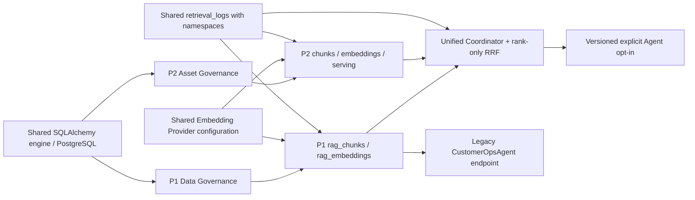

# P1/P2 Post-Release Completeness, Coupling and Effectiveness Audit

## 1. Executive Summary

The sealed P1 and P2 releases remain operational in the authoritative local Docker environment. The audit found **no confirmed P0 defect**, no P1/P2 vector-table pollution, no unreviewed-content recall, no archived leakage, no default CustomerOpsAgent behavior change, no source-trace break, and no data loss during the tested restart. P1 completed 23/23 scoped capabilities. P2 completed 38/40 capabilities; the OCR/Caption/Metadata extraction operation remains a mock/provider contract plus human-revision bridge, and Unified Retrieval is operational but its exact-ID Eval is not repeat-run stable in an accumulated corpus.

The release is not “problem free.” Fifteen evidence-backed findings are recorded: **P0=0, P1=1, P2=8, P3=6**. The P1 finding is the absence of real authentication/authorization on governance and administrative write APIs; `X-DataHub-Client` is a client contract marker, not identity. Important P2 findings include a stale/incomplete operator UI, Eval corpus isolation, lack of real PostgreSQL/concurrency/frontend tests, create-all-only schema evolution with no foreign keys, no ANN vector index, and no-answer queries returning evidence. These findings do not justify moving or rewriting either release tag. They justify a small post-release maintenance sequence before broader exposure.

## 2. Scope and Stable Baseline

- Audit start commit: `45bb23ec6d458838d0aec318e735fca671637c36`.
- P1 tag: `p1-m24.3-real-embedding-online-release` -> `37859bc2cc912edfbad4037ab049cceba41fea1d`.
- P2 tag: `p2-m9-local-docker-release` -> `45bb23ec6d458838d0aec318e735fca671637c36`.
- Authority environment: local Docker Compose with PostgreSQL 16, pgvector, backend, frontend, database volume, Asset volume and runtime-manifest volume.
- Render P2 Deployment Acceptance remains **BLOCKED** by missing Persistent Disk and was not reclassified.
- No business code, schema, frontend code, test code, script, Docker configuration, release tag, volume, runtime manifest or stored Asset was changed by this audit.

## 3. Evidence Used

The conclusion cross-checks four evidence classes:

1. planning and acceptance sources: docs 00–36, 40–56, README, ADRs, roadmaps and release reports;
2. implementation: 55 live OpenAPI operations, SQLAlchemy models/repositories/services, frontend routes/fetch calls, Compose/Dockerfiles and environment reads;
3. automation: 39 backend test files and 379 collected tests, Harness/Eval/Acceptance/Smoke runners and build commands;
4. runtime: fresh P1/P2 chains, P2 and Unified Evals, both Agent flag modes, timeout degradation, PostgreSQL/pgvector health and restart persistence.

File existence alone was not accepted as completion evidence. A Complete item requires a reachable entry, a real state/output, test or runtime evidence, and downstream use.

## 4. Functional Completeness Summary

| Release | Scoped requirements | Complete | Partial | Missing | Deferred/Invalid |
|---|---:|---:|---:|---:|---:|
| P1 | 23 | 23 | 0 | 0 | 0 |
| P2 | 40 | 38 | 2 | 0 | 0 |

P2 Partial items are not hidden failures:

- OCR/Caption/Metadata use one governed extraction structure, but the shipped extraction provider is deterministic mock only; authoritative acceptance uses legal Review revision to supply controlled text. Real OCR/Caption/Vision providers remain outside the implemented release.
- Unified Retrieval works and remains better than its P1 control, but exact-ID recall varies with retained repeated acceptance corpora. It therefore lacks repeat-run Eval stability even though archive leakage remains zero.

## 5. P1 Requirement Traceability Matrix

Abbreviations: `storage.py` is the P1 orchestration/compatibility layer; `db_repo` is `backend/app/db_repositories.py`; FE is `frontend/src/pages/P1TextHub.tsx`.

| Phase | Requirement | Planning Source | Implementation | Database | API | Frontend | Automated Test | Runtime Evidence | Status | Risk | Notes |
|---|---|---|---|---|---|---|---|---|---|---|---|
| P1 | Data import | docs 02/04/07/28 | `create_raw_batch`, DB-first repository | `raw_batches`, `raw_messages` | `POST /api/sources/import-json` | import form | import persistence/phase flow | Harness step 02 | Complete | P3 | duplicate import idempotent |
| P1 | Raw isolation | docs 03/07/22 | raw/sanitized split | raw vs sanitized tables | source detail | raw metadata separated | phase/import tests | Harness trace | Complete | P3 | no raw content in retrieval |
| P1 | Machine cleaning | docs 07/18/28 | `run_cleaning` rules | `sanitized_*` | cleaning run/status | workflow step | advanced cleaning | Harness step 03 | Complete | P3 | synchronous job abstraction |
| P1 | Redaction | docs 07/18 | PII cleaning rules | sanitized fields/PII JSON | cleaning result | PII indicators | advanced cleaning | Harness sanitized 8/8 | Complete | P2 | rule-based, not model-based |
| P1 | Manual cleaning | docs 19/29 | `manual_clean_sanitized_message` | `manual_cleaning_records` | manual-clean PATCH | editable Chinese console | manual cleaning/persistence | Harness step 04 | Complete | P3 | raw remains immutable |
| P1 | Chinese operator UI | docs 24/32–34 | `P1TextHub` | n/a | workflow APIs | Chinese dark console | build only | production build PASS | Complete | P2 | no frontend automated tests |
| P1 | Candidate generation | docs 02/07/28 | `run_extraction` | `knowledge_candidates` | extraction run | workflow action | manual-review persistence | Harness step 05 | Complete | P3 | rule-based extraction |
| P1 | Human review | docs 20/29 | decision orchestration | `review_records` | approve/reject/revision | review editor | review console/persistence | Harness step 06 | Complete | P1 | reviewer identity is self-asserted |
| P1 | Review transitions | docs 04/20 | status guards | candidate status + records | review actions | terminal labels | quality/review tests | approved path plus negative tests | Complete | P2 | authorization gap remains |
| P1 | Approved-only retrieval | docs 07/11/30 | RAG builder filters approved | candidates/chunks/embeddings | RAG build/retrieve | RAG action | approved vector sync | Harness vector retrieve | Complete | P0 | no bypass observed |
| P1 | PostgreSQL persistence | docs 26–31 | SQLAlchemy repositories | P1 tables | all DB-first APIs | refreshable | persistence suites | Docker DB healthy | Complete | P1 | no migration framework/FKs |
| P1 | RAG chunk | docs 15/16/30/35 | chunk builder | `rag_chunks` | build/list/detail/search | build button | RAG quality/persistence | chunk_count=6 audit run | Complete | P2 | Harness rebuild changes corpus |
| P1 | SiliconFlow embedding | docs 35/36 | shared embedding provider | `rag_embeddings` | RAG build/retrieve | indirect | provider/vector tests | real 1536 in Harness | Complete | P1 | provider config shared with P2 |
| P1 | pgvector retrieval | docs 35/36 | cosine query + fallback | vector column | CustomerOps retrieve | retrieval panel | semantic retrieval | vector mode, fallback false | Complete | P1 | no ANN index at current scale |
| P1 | CustomerOps retrieval | docs 11/17 | `run_customerops_retrieval` | chunks/embeddings/logs | old endpoint permanent | query panel | retrieval suites | Harness step 08 | Complete | P0 | old default path unchanged |
| P1 | Evidence/source trace | docs 11/16/30 | result mapping | metadata/logs | retrieve + trace GET | evidence display | retrieval tests | trace IDs present | Complete | P1 | P2/Unified ids rejected by old trace GET |
| P1 | Bad Case submit | docs 04/08/30 | create bad case | `bad_cases` | CustomerOps bad-cases | submit form | bad-case tests | Harness step 09 | Complete | P2 | admin auth absent |
| P1 | Bad Case draft | docs 30 | draft generator | candidates + bad case link | create-draft | draft workflow | DB tests | Harness step 10 | Complete | P2 | idempotency covered |
| P1 | Bad Case feedback loop | docs 10/21/30 | pending-review candidate link | logs/bad cases/candidates | queue/update/draft | feedback flow | feedback tests | full Harness | Complete | P2 | does not auto-approve |
| P1 | History/traceability | docs 03/11/30 | immutable raw/reviews/logs | audit tables/metadata | list/detail/trace | history panels | persistence tests | runtime IDs | Complete | P2 | relational integrity app-enforced |
| P1 | Failure handling | docs 11/35/36 | safe errors and keyword fallback | failure metadata/logs | stable errors | feedback messages | dimension/error tests | timeout/fallback tests | Complete | P2 | DB/storage E2E fault injection absent |
| P1 | Pipeline Harness | docs 36/README | `run_p1_pipeline_harness.py` | creates trace corpus | public APIs only | n/a | 24 runner tests | 10/10 audit run | Complete | P2 | repeated runs mutate shared corpus |
| P1 | Docker compatibility | docs 53/56/README | Compose backend/DB/frontend | persistent volume | health endpoints | built SPA | Docker static tests | health/restart PASS | Complete | P2 | external health consumers must inspect nested DB state |

## 6. P2 Requirement Traceability Matrix

FE refers to `frontend/src/pages/P2MaterialCenter.tsx`. “Acceptance” refers to audit trace `p2-local-20260716-124258-06219bc4` without recording runtime IDs in Git.

| Phase | Requirement | Planning Source | Implementation | Database | API | Frontend | Automated Test | Runtime Evidence | Status | Risk | Notes |
|---|---|---|---|---|---|---|---|---|---|---|---|
| M1 | Asset upload | docs 40–42 | Asset service/routes | `assets` | upload | upload form | Asset ingestion | Acceptance upload | Complete | P1 | management auth absent |
| M1 | Type/size validation | docs 41/42 | magic bytes, MIME, extension, limit | metadata | upload errors | accept filter + errors | illegal/large tests | valid upload | Complete | P2 | image only by scope |
| M1 | SHA-256 dedup | docs 41/42 | content hash + unique index | `assets.hash` | duplicate response | locates existing Asset | duplicate test | acceptance unique traces | Complete | P2 | concurrent storage/DB window needs fault test |
| M1 | Local Storage Adapter | docs 41/42 | `AssetStorageAdapter` | URI only | upload/detail | metadata | path/render tests | Docker file exists | Complete | P1 | no cloud adapter by scope |
| Docker | Named-volume persistence | docs 53/56 | Compose `asset_storage` | n/a | detail after restart | indirect | Docker config tests | row/file survived restart | Complete | P1 | Render still blocked |
| M2 | Extraction Job | docs 40/43 | service + repositories | `extraction_jobs` | create/status | result view only | extraction tests | Acceptance | Complete | P2 | retry has no product entry |
| M2 | OCR/Caption/Metadata structure | docs 40/43 | typed `extract_type`, normalized result | jobs/extractions | extract/list | view by type | extraction tests | three governed types | Partial | P2 | real media extraction is not shipped |
| M2 | Mock/real provider boundary | docs 43 | abstract provider + explicit mock-only factory | provider field | provider validated | no provider control | provider failure/retry | mock marked synthetic | Complete | P3 | real provider deferred honestly |
| M3 | Extraction revision | docs 44 | Review `revised_content`, original immutable | reviews/snapshots | review PATCH | editor | review immutability tests | controlled acceptance text | Complete | P1 | revision belongs to Review, not Extraction mutation |
| M3 | Human Review | docs 44 | Review service | `extraction_reviews` | create/get/patch | review workspace | review tests | Acceptance | Complete | P1 | identity self-asserted |
| M3 | Decisions | docs 44 | guarded terminal decisions | review status | PATCH | three buttons | transition tests | approved chain | Complete | P1 | needs_revision creates later review version |
| M3 | Immutable Snapshot | docs 44 | atomic approved snapshot | `asset_review_snapshots` | snapshots GET | trace list | immutability tests | Acceptance | Complete | P0 | no unreviewed snapshot path found |
| M4 | Knowledge Asset publish | docs 45 | publish service | `knowledge_assets` | snapshot publish | publish button | M4 tests | Acceptance | Complete | P0 | approved source checked |
| M4 | Publish idempotency | docs 45 | unique snapshot/idempotent return | unique source snapshot | publish | state note | idempotency test | repeated runner safe | Complete | P2 | PostgreSQL concurrency needs direct test |
| M4 | Version management | docs 45 | per-Asset/content version | version column | list/detail | version shown | version test | v1/v2 acceptance | Complete | P1 | row lock used |
| M4 | Old-version archive | docs 45/49 | active predecessor + index archive | asset/index statuses | publish/archive | archive action | M4/M6/M8 tests | old version zero hit | Complete | P0 | physical vector retained safely |
| M4 | Source trace | docs 45 | lineage reconstruction | indexed string IDs | detail/list | trace grid | trace tests | complete Acceptance trace | Complete | P1 | no database FKs |
| M6 | Index Entry | docs 46/47 | Index service | `p2_knowledge_index_entries` | index/list/detail/archive | create/status | M6 tests | Acceptance | Complete | P1 | control plane isolated |
| M6 | Chunk projection | docs 47 | deterministic projection | `p2_knowledge_chunks` | index detail | chunk count | immutable chunk test | chunk ID in trace | Complete | P1 | one chunk per current Asset content |
| M6 | Fingerprint | docs 47 | SHA content/profile inputs | indexed fingerprint | details/gates | status only | stability/mismatch tests | serving gate | Complete | P0 | checked twice on retrieval |
| M7 | P2 embedding | docs 48 | embedding service/repository | `p2_knowledge_embeddings` | embed/list | no action | M7 tests | real SiliconFlow | Complete | P1 | UI requires API/script |
| M7 | Provider/model/dimension/profile | docs 48 | shared provider + P2 profile | immutable fields | embed/list/search | no detail UI | dimension/profile tests | 1536/profile recorded | Complete | P1 | shared environment coupling |
| M8.1 | Explicit Serving Gate | docs 49/50 | validate then `ready -> serving` | entry status/sync | serve | no action | 16+ gates | before 0/after hit | Complete | P0 | embed remains ready |
| M8.1 | P2-only retrieval | docs 50 | isolated service/repository | P2 tables only | v2 P2 search | no search UI by scope | 20 tests | vector mode | Complete | P1 | no P1 fallback |
| M8.1 | Archive zero recall | docs 49–51 | SQL filter + post-filter | statuses + vectors | archive/search | archive available | archive/race tests | leakage 0 | Complete | P0 | physical vector may remain |
| M8.1 | P2 Eval | docs 50/51 | runner + runtime manifest | serving corpus | P2 search | n/a | Eval tests | recall 1.0, MRR .52 | Complete | P1 | P2 run exact metric stable in this run |
| M8.2 | Unified Retrieval | docs 49/54 | coordinator service | shared logs only | v2 unified search | no UI by scope | M8.2 tests | candidate > control | Partial | P2 | exact-ID repeat stability gap |
| M8.2 | Independent recall | docs 49/54 | P1/P2 adapters + independent sessions | physical P1/P2 tables | unified API | n/a | adapter/failure tests | both branches OK | Complete | P0 | no cross-index score comparison |
| M8.2 | RRF late fusion | docs 49/54 | reciprocal rank fusion k=60 | none | unified response | n/a | rank-only tests | candidate modes RRF | Complete | P1 | top-k competition affects exact IDs |
| M8.2 | Source-aware dedup | docs 49/54 | route identity + P2 Asset quota | none | response | n/a | dedup tests | duplicate rate 0 | Complete | P2 | semantic duplicates across different Assets remain |
| M8.2 | Shadow control/candidate | docs 49/54 | control-visible/candidate logged | retrieval logs | shadow request | n/a | shadow contract tests | 0 violations | Complete | P0 | does not alter old endpoint |
| M8.2 | Single-branch degradation | docs 49/54 | time-bounded branch isolation | logs | unified API | n/a | timeout tests | 50 ms fault evidence | Complete | P1 | executor bounded |
| M8.3 | Agent explicit opt-in | docs 55 | versioned Agent service | retrieval logs | v2 Agent retrieve | no UI by scope | 12+2 tests | explicit Unified PASS | Complete | P0 | old endpoint unchanged |
| M8.2/3 | Feature flags default off | docs 49/54/55 | fail-closed parsers | none | v2 gates | n/a | flag tests | restored all false | Complete | P0 | configuration distributed across two services |
| M8.3 | Unified failure -> P1 | docs 55 | safe catch/degraded rejection | P1 log + Unified log | v2 Agent | n/a | failure tests | 50 ms fallback | Complete | P0 | P1 rerun independent |
| Docker | Clone-style deployment | docs 53/56/README | Compose/build/init/health | named volumes | all | SPA | Docker tests | config/build/up PASS | Complete | P1 | local authority only |
| Docker | Restart persistence | docs 53/56 | volumes/idempotent init | PostgreSQL + object volume | detail | list/detail | static config | row/file survived | Complete | P0 | no volume deletion performed |
| Docker | README quick deployment | README/docs 53 | documented commands | n/a | n/a | n/a | commands re-run | config/build/up PASS | Complete | P2 | P2 UI status text conflicts with README |
| Security | Safe configuration/secrets | docs 41/48/53/56 | ignored env, runtime injection, safe errors | no secrets in rows | scrubbed errors | no secret fields | secret/error tests | audit scan clean | Complete | P1 | authorization is a separate gap |
| Boundary | Honest Render blocker | docs 51/53/56/README | storage fail-closed | no binary DB fallback | upload 503 on Render | boundary text | storage tests | not retried as success | Complete | P1 | Deployment Acceptance BLOCKED |

## 7. Confirmed Defects and Gaps

There are **zero confirmed defects** against the sealed core release-safety contract and four confirmed gaps. Detailed finding records are in section 15.

1. **AUD-001**: no real authentication/authorization for administrative and governance APIs.
2. **AUD-002**: P2 frontend is stale and cannot drive the whole Asset-to-Serve chain.
3. **AUD-009**: runtime configuration and `.env.example`/Compose have drifted.
4. **AUD-015**: no-answer Unified/P2 queries can still return five low-confidence evidence items; there is no calibrated refusal contract.

## 8. Test Gaps

Ten distinct test gaps are planned in docs 59:

- true PostgreSQL/pgvector automated integration;
- frontend component/E2E coverage;
- run-scoped Eval isolation and repeat stability;
- lifecycle concurrency and row-lock behavior;
- transaction rollback and partial external-provider failure;
- database/storage/log failure injection;
- schema migration and historical-volume compatibility;
- OpenAPI/legacy contract snapshots;
- authentication/authorization and adversarial content tests;
- performance/index/query-plan regression.

## 9. Dead, Obsolete and Unreachable Candidates

These are candidates, not deletion instructions:

| Candidate | Classification | Evidence | Decision |
|---|---|---|---|
| `AdvancedPage.tsx` | Obsolete Candidate | not registered in `App.tsx`; claims JSON-only/no DB/no vectors | remove or rewrite only after frontend tests |
| `ExtractionService.retry_job` / `retrying` | Valid but product-unreachable | called by one test; no retry API/UI | expose intentionally or narrow the advertised lifecycle |
| Compose `LLM_*` | Compatibility/Future or Redundant | no backend LLM module reads them | document as inert or remove in maintenance |
| `LOG_LEVEL`, `DEBUG`, `DATAHUB_ENV` | Redundant configuration candidate | Compose/template set; application does not read | verify entrypoint/framework use before cleanup |
| uncalled repository list helpers | Unable to Prove | several public helpers have no route/service/test caller | retain until call graph/compatibility review |

Framework route handlers with no direct Python caller are not dead code; FastAPI registers them indirectly. Harness/Eval scripts are distinct release tools rather than automatic duplicates.

## 10. P1/P2 Coupling Graph

### Coupling classification

| Source -> Target | Type | Class | Failure propagation | Coverage | Recommendation |
|---|---|---|---|---|---|
| P1/P2 -> DB/session | shared infrastructure | A: intentional | DB outage affects both | health/persistence, no fault E2E | keep; add fault tests |
| P1/P2 -> embedding provider env | config/provider sharing | C: risk | model/env change can affect both builds/queries | dimension/profile tests | introduce resolved profile objects without changing tables |
| P1/P2/Unified -> `retrieval_logs` | shared audit sink | B/C | log/schema/retention issue spans modes; request path swallows log errors | namespace tests; old GET rejects P2/Unified ids | formalize namespace reader/retention contract |
| `main.py` -> P2 extraction job lookup | compatibility multiplexing | B/C | P2 import/path logic lives in sealed P1 composition root | API tests | move only in additive versioned maintenance router |
| all models -> one `db_models.py`, string lineage | schema/integrity | C | no FK prevents DB-enforced lineage; application checks compensate | source-trace gates | migration/FK feasibility review |
| Unified -> P1/P2 adapters | coordinator dependency | A: intentional | branch failures isolated; P1 fallback works | extensive timeout tests/runtime | keep unchanged |
| old Agent endpoint -> P2 | none found | A: desired absence | P2 failure does not affect default P1 | old endpoint and runtime Harness | preserve permanently |

No P2 module writes `rag_chunks` or `rag_embeddings`; no sealed P1 retrieval module imports P2. Unified is an additive logical coordinator.

## 11. State Machine and Lifecycle Audit

| Machine | Reachable/guarded states | Evidence | Gap/risk |
|---|---|---|---|
| P1 import/clean | raw -> sanitized -> manual decision | Harness + persistence tests | jobs synchronous; recovery/DB outage not E2E tested |
| P1 review | pending -> approved/rejected/needs_revision | tests + Harness | reviewer is not authenticated |
| P1 RAG sync | approved -> chunk/embedding | approved-only tests | rebuild replaces current sync corpus; Harness isolation weak |
| Bad Case | open/triaged/resolved/ignored -> optional pending draft | tests + Harness | concurrent duplicate draft not PostgreSQL-tested |
| Asset | uploaded | upload tests | no delete lifecycle by scope |
| Extraction | pending -> running -> success/failed; failed -> retrying -> running | service tests | retry unavailable through product API; synchronous observation only |
| Review/Snapshot | pending -> terminal; approved atomically emits immutable Snapshot | row lock + tests | real concurrent decisions not tested |
| Knowledge Asset | active -> archived; new active version archives old and Index | row lock + tests/runtime | no DB FKs; concurrent version allocation needs PostgreSQL test |
| Index | pending -> building -> ready -> serving -> archived; failed -> building | transition map/tests | embed/archive and serve/replacement races need real DB tests |
| Embedding | immutable profile rows; build success leaves ready | fingerprint/idempotency tests | provider partial-batch/commit failure test missing |
| Unified feature | default off; shadow and active separated | flag tests/runtime | flags parsed in multiple services |

No terminal Review/Snapshot mutation, serve/embed collapse, archive visibility delay, or old-version recall was observed. Archive visibility is enforced at SQL recall and post-recall governance gates.

## 12. API and Frontend Audit

The live OpenAPI contains **55 operations**. All nine modular P2/Unified/Agent routers are registered. No frontend call was found for a nonexistent backend route. The old P1 CustomerOps endpoint and response remain usable.

| API group | Operations | Reachability/use | Auth/validation | Frontend status |
|---|---:|---|---|---|
| P1 governance/RAG/Bad Case | 32 | FE + Harness + tests | validation; no real admin auth | P1 workflow usable |
| P2 Asset/Extraction/Review/Knowledge/Index/Embedding | 19 | API, FE subset, Acceptance | validation; no admin auth | upload/review/publish/index/archive only |
| P2-only retrieval | 1 | Eval/Acceptance | schema/gates; no caller auth | intentionally no search page |
| Unified retrieval | 1 | Eval/Shadow | default-off flags; no caller auth | intentionally no UI |
| Agent v2 | 1 | explicit integration/smoke | client header + flags, not identity auth | intentionally no UI |
| health | 2 | Compose/UI | safe nested diagnostics | UI checks only top-level `status` |

Frontend effectiveness findings:

- `HomePage.tsx` marks P2 disabled and prevents its card navigation although the top navigation exposes the P2 page.
- `P2MaterialCenter.tsx` still says P2-M6 and claims Embedding/vector/Unified/Agent are absent.
- The P2 page can upload, list/detail, review, publish, index and archive, but cannot start Extraction, Embed or Serve; a user must use APIs/scripts.
- `AdvancedPage.tsx` is unrouted and contains obsolete JSON-only/no-vector claims.
- P3/P4 pages are visible from top navigation but clearly label future/unconnected scope; no confirmed fake action was found.
- There is no frontend test command or test file, so build success cannot protect behavioral claims.

## 13. Docker and Configuration Audit

Compose provides PostgreSQL/pgvector, one-shot volume/database initialization, backend and frontend; health-gated ordering and named volumes are effective. The backend healthcheck checks nested DB and pgvector fields, not only HTTP 200. Asset and database persistence survived service restarts.

Configuration gaps:

- `P2_RETRIEVAL_MIN_SCORE` is read with default `0.45` but is absent from `.env.example` and Compose pass-through.
- Compose/template expose `LLM_*`, `LOG_LEVEL`, `DEBUG` and `DATAHUB_ENV`, but no current backend application module reads them.
- `ASSET_STORAGE_ROOT`, `DATABASE_URL` and CORS are correctly Compose-owned; OpenAI variables are compatibility aliases; `RENDER` is platform detection. Their absence from the public template is not automatically a defect.
- P1 and P2 use the same `EMBEDDING_*` provider/model/dimension; P2 adds a recorded profile. This is workable but creates change coupling.
- Database initialization uses `Base.metadata.create_all`, not versioned migrations. It is idempotent for missing tables but cannot prove safe upgrades of changed columns/constraints.
- `docker compose down` versus `down -v` and Render limitations are documented honestly.

## 14. Test Coverage and Runtime Results

### Inventory

- 39 backend test files; 379 tests collected.
- Clean tracked-HEAD export: **379 passed, 44 warnings in 119.55 seconds**.
- Most persistence/service tests use SQLite and mock providers.
- Docker tests primarily inspect configuration; real Docker E2E evidence comes from external runners.
- No frontend test framework/test script/test file exists.
- No coverage dependency was installed and no dependency was changed.

### Audit runtime evidence

| Gate | Result |
|---|---|
| compileall | PASS |
| frontend production build | PASS, 49 modules transformed |
| P1 Harness | 10/10; SiliconFlow 1536; vector mode; fallback false; Bad Case PASS |
| P2 Acceptance | real SiliconFlow; ready 0; serving hit; archive 0; old version 0 |
| P2 Eval | 12/12 semantic; exact recall@5 1.0/10; MRR .52; leakage 0; failures 0 |
| Unified Shadow | candidate query hit 1.0 vs control .5556; exact .7143 vs 0; MRR .25 vs 0; coverage 1.0; leakage 0; violations 0 |
| Agent default/active | default and flag-off P1; explicit active Unified P1+P2; leakage 0 |
| Agent fault | 50 ms branch timeout -> P1 fallback with safe reason |
| persistence | Asset row and binary survived backend/PostgreSQL restart; DB/pgvector healthy |

The Unified exact recall change from release-time 0.8571 to audit-time 0.7143 is reproducible evidence of an accumulated-corpus test problem. Repeated acceptance runs create new semantically overlapping Assets/Knowledge Assets. Source-aware dedup limits chunks per same Asset, but different Assets still compete for a small RRF top-k. Dynamic exact IDs then fall outside the candidate window. Candidate still exceeds control, keyword coverage remains 1.0, and leakage remains zero; this is not P1/P2 index pollution.

## 15. Detailed Findings

| ID | Severity | Category / Area | Evidence and inspection | User impact | Current protection | Recommended action | Phase / Scope | Confidence |
|---|---|---|---|---|---|---|---|---|
| AUD-001 | P1 | Confirmed gap / authorization | 55-route OpenAPI and handlers: management writes have validation but no identity/RBAC; Agent header is spoofable | public/demo caller can import, self-identify reviewer, approve, rebuild or archive | approved-state gates and CORS; local-release boundary | add authenticated admin boundary and role tests without changing old retrieval response | M9.1 / M | High |
| AUD-002 | P2 | Confirmed gap + documentation drift / frontend | Home marks P2 disabled; P2 page says M6 and has no Extraction/Embed/Serve calls | operator cannot complete advertised chain through UI and sees false phase text | APIs and Acceptance scripts work | update status and add only governed actions after E2E tests | M9.3 / M | High |
| AUD-003 | P2 | Test gap / Eval stability | Unified exact recall .8571 -> .7143 after retained runs; exact misses while term hits remain | release comparison depends on database history | candidate remains > control; leakage 0 | run-scoped namespace/cleanup fixture and repeated-run gate | M9.1 / M | High |
| AUD-004 | P2 | Test gap / PostgreSQL | pytest persistence paths are SQLite; Docker positive runners are external | PostgreSQL SQL/locking/vector regressions may escape unit suite | release runners and 20 P2 retrieval tests | add containerized PostgreSQL/pgvector integration subset | M9.1 / M | High |
| AUD-005 | P2 | Test gap / concurrency and rollback | row locks exist, but no real concurrent publish/embed/serve/archive/version replacement; limited mocked races | duplicate versions or cross-table drift could occur under contention | unique constraints, locks, double gates | fault/concurrency suite before refactor | M9.1 / M | High |
| AUD-006 | P2 | Test gap / frontend | package has build only; zero test/spec files | stale/disabled UI survived release | TypeScript production build | component + browser E2E for P1/P2 critical path | M9.3 / M | High |
| AUD-007 | P2 | Design risk / schema evolution | zero DB foreign keys; `create_all` only; lineage uses string IDs | historical upgrades/orphans are not DB-enforced | application source-trace validation and indexes | migration inventory, orphan audit, additive migration tooling evaluation | M9.2 / L | High |
| AUD-008 | P2 | Optimization opportunity / retrieval | PostgreSQL index inventory has no HNSW/IVFFlat; service preloads all serving rows for profile validation before vector query | latency/scan cost grows with corpus | current small corpus; top-k and score threshold | EXPLAIN-based profile-specific indexing and aggregate profile gate | M9.4 / M | High |
| AUD-009 | P3 | Confirmed gap / configuration | live code reads undocumented `P2_RETRIEVAL_MIN_SCORE`; multiple Compose/template variables are unread | Docker operators cannot tune one real gate and may believe inert knobs work | safe defaults | publish a generated env contract; remove or mark inert variables | M9.2 / S | High |
| AUD-010 | P3 | Coupling risk / logs | P1/P2/Unified share `retrieval_logs`; namespaces work; old P1 trace GET returns 404 for P2/Unified IDs | retention/schema change can span modes | prefixes, namespaces, safe log failure | formalize namespace readers/index/retention; keep one table for now | M9.2 / S | High |
| AUD-011 | P3 | Coupling risk / embedding config | both indexes resolve the same `EMBEDDING_*`; P2 profile adds validation | changing provider for one release can affect the other at process level | stored provider/model/dimension/profile gates | create immutable resolved config objects and startup compatibility report | M9.2 / M | High |
| AUD-012 | P3 | Coupling risk / composition | `main.py` registers all routers and multiplexes P1/P2 extraction-job status by ID prefix | sealed P1 composition root knows one P2 repository | namespaced IDs and regression tests | move compatibility dispatch behind additive router/service only with contract tests | M9.2 / S | High |
| AUD-013 | P3 | Unreachable candidate / Extraction retry | `retry_job` and `retrying` are called by a test, not route/UI/CLI | failed jobs have no supported operator retry | new extraction request remains possible | decide API exposure vs lifecycle narrowing; do not delete blindly | M9.3 / S | High |
| AUD-014 | P3 | Obsolete candidates / frontend/config/helpers | unrouted obsolete Advanced page, inert env groups and uncalled repository helpers | maintenance confusion; false documentation if reintroduced | page is unreachable; variables mostly harmless | prove callers then clean one class at a time | M9.3 / S | Medium |
| AUD-015 | P2 | Confirmed gap / no-answer effectiveness | Unified no-answer query returned 5 evidence items; no calibrated rejection contract | Agent opt-in may consume irrelevant evidence | P2 min score and Agent default-off | label no-answer set, calibrate threshold/refusal and regression test | M9.1 / M | High |

## 16. Performance and Ineffective Overhead

| Observation | Evidence type | Conclusion |
|---|---|---|
| Unified branches are parallel | Measured + code | branch pool/wait and latency show parallel behavior; keep |
| query embedding is generated separately by P1 and P2 | Inferred from independent adapters | expected with different index contracts; do not share until profile compatibility is explicit |
| P2 serving-row preflight loads all eligible rows | Confirmed code | will become avoidable overhead at scale |
| source trace post-filter performs per-candidate repository lookups | Confirmed code | potential N+1 bounded by candidate limit; measure before changing |
| vector search has no ANN index | Confirmed database inventory | sequential scan acceptable only for current small corpus |
| retrieval logging is synchronous but exceptions are swallowed | Confirmed code | adds request latency; value is high, measure before async change |
| repeated `create_all` at import/start/db-init | Confirmed code/Compose | redundant but idempotent; migration plan is more important than micro-optimization |
| frontend status workspace performs four parallel reads | Confirmed code | not a serial N+1; caching remains unproven |
| management embedding list omits vectors and is paginated | Confirmed schema/API | no issue found |

## 17. No Confirmed Issue Found

- P1/P2 index pollution: **No confirmed issue found**.
- unreviewed P2 content entering Knowledge Asset/serving retrieval: **No confirmed issue found**.
- archived or superseded P2 leakage: **No confirmed issue found**; count remained zero.
- default CustomerOpsAgent switching away from P1: **No confirmed issue found**.
- raw cosine scores compared across indexes: **No confirmed issue found**; fusion is rank-only.
- source trace loss in accepted P1/P2/Unified results: **No confirmed issue found**.
- complete vectors or secrets returned/logged: **No confirmed issue found**.
- Docker volume data loss during tested restarts: **No confirmed issue found**.
- Render P2 falsely claimed online: **No confirmed issue found** in current release docs.

## 18. Deferred by Scope

Native image embeddings, image-to-image retrieval, CLIP, multimodal reranking, real OCR/Caption/Vision providers, S3/R2/OSS, Render Persistent Disk and online P2 acceptance, default Agent Unified cutover, P3/P4, model fine-tuning, asynchronous indexing clusters and large-scale load testing remain Deferred. Their absence is not counted as a release defect.

## 19. Release Decision

Do **not** move, delete or rewrite either sealed tag. Core release safety still passes, so no emergency rollback is recommended. Because one P1 security gap and several high-confidence P2 safety/effectiveness test gaps exist, begin a separate post-release maintenance line before exposing governance APIs to untrusted users or enabling Unified by default.

Recommended next stage: **P1/P2-Maintenance M9.1 Release Safety and Eval Isolation**. Limit it to authentication/authorization design and safety tests, run-scoped Eval corpus isolation/repeat stability, PostgreSQL lifecycle/fault tests, and no-answer gating planning/validation. Do not combine coupling refactors or dead-code cleanup into that stage.
