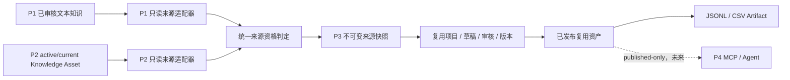

# P3 架构与数据契约

> 状态：P3-M0.1 架构审核通过并冻结；契约未实现，P3-M1 尚未开始。
> 本文中的表、API、权限和错误码均为规划契约，不表示当前仓库已具备这些能力。

## 1. P3 在 DataHub 中的位置



边界规则：

- P1/P2 表只作为 SELECT 来源。P3 不调用 P1/P2 写 API，不更新其状态。
- P3 数据写入独立 `reuse_*` / `export_*` 表。
- P3 发布和导出不依赖 P1/P2 检索索引，也不改变 `rag_*`、`p2_knowledge_*` 或 CustomerOpsAgent。
- P4 未来只消费 published、current、non-archived P3 资产；不能访问草稿、审核写接口或内部来源快照。

## 2. 当前事实与适配边界

### 2.1 P1 当前事实

- `knowledge_candidates.status` 承载 `pending_review/needs_revision/approved/rejected`。
- `review_records.action` 保存审核结论，`snapshot_json` 保存审核时 Candidate 快照。
- P1 Candidate 没有独立 version/archived 列，业务字段可在现有更新路径中变化。
- Bad Case 的 `resolved` 只表示已创建或处理修正草稿，不表示该修正知识已 approved。

P3 适配结论：

- P1 合法来源是 approved Candidate 加 approved Review 快照证据。
- Candidate 当前规范化指纹必须等于批准快照指纹；否则拒绝。
- Bad Case 只通过其 approved Candidate 间接进入 P3。

### 2.2 P2 当前事实

- approved Review 原子地产生不可变 `AssetReviewSnapshot`。
- approved Snapshot 发布为 `KnowledgeAsset.status=active`。
- 发布同一 `asset_id + content_type` 新版本时，旧 active Knowledge Asset 被归档。
- `ready/serving` 属于索引生命周期；active Knowledge Asset 属于治理发布生命周期。

P3 适配结论：

- P2 合法来源是 approved Review 支撑的 active 当前 Knowledge Asset。
- `ready` 但未 `serving` 不影响 P3 资格。
- draft、archived、非最高有效版本或 Source Trace 不完整均拒绝。

## 3. 只读来源资格契约

### 3.1 统一来源引用

```json
{
  "source_kind": "p1_candidate | p2_knowledge_asset",
  "source_id": "stable source id",
  "expected_version": 3,
  "expected_review_id": "review id",
  "expected_content_hash": "sha256 hex"
}
```

P1 没有实体版本号时，`expected_version` 为空，使用 approved `review_id`、`updated_at` 和内容指纹共同标识批准版本。

### 3.2 资格结果

```json
{
  "eligible": true,
  "policy_version": "p3-source-eligibility-v1",
  "checked_at": "UTC ISO-8601",
  "canonical_source_key": "p2_knowledge_asset:knowledge_asset_x:v3",
  "reason_codes": [],
  "content_hash": "sha256 hex",
  "source_trace": {}
}
```

资格判定必须是纯函数式服务：相同源状态与相同 policy version 返回相同结论，不写 P1/P2。

### 3.3 P1 判定

必须全部满足：

1. Candidate 存在且 `status=approved`。
2. 最新有效 ReviewRecord 的 `action=approved`。
3. ReviewRecord `snapshot_json` 具有 question、answer、intent、tags、risk_level、knowledge_type 和上游来源标识。
4. 当前 Candidate 的批准字段规范化指纹与 Review 快照指纹一致。
5. question/answer 非空，来源类型属于允许集合。
6. 若 `source_type=bad_case`，则 Bad Case 存在、`status=resolved`、关联 Candidate 一致。
7. 来源 Trace 不包含缺失的必需 ID。
8. PII/禁用内容预检通过。

拒绝状态示例：`SOURCE_NOT_APPROVED`、`SOURCE_APPROVAL_DRIFT`、`SOURCE_TRACE_INCOMPLETE`、`BAD_CASE_CORRECTION_NOT_APPROVED`。

### 3.4 P2 判定

必须全部满足：

1. Knowledge Asset 存在且 `status=active`。
2. 它是同一 `asset_id + content_type` 的当前最高有效版本。
3. `source_snapshot_id` 对应 Snapshot 存在。
4. Snapshot 对应 Review 存在且 `review_status=approved`。
5. Snapshot、Review、Extraction、Asset 和 Knowledge Asset ID 关系一致。
6. Source Trace 必填字段完整，内容指纹与当前 Knowledge Asset 内容一致。
7. 不要求 index status 为 `serving`；`ready/serving` 仅作为观察元数据。
8. PII/禁用内容预检通过。

### 3.5 重检时点

必须在以下时点重检，不得只信任捕获时状态：

- 提交 P3 人工审核前。
- 审核批准前。
- 发布前。
- 创建 ExportJob 前。

来源在生成/编辑期间失效时，历史内容保留但 `source_validity_status` 标记为 `source_stale`，禁止继续正式流转；这不混入资产生命周期 `status`。

## 4. 领域模型方案比较

### 4.1 最小模型方案

| 对象 | 职责 |
|---|---|
| `ReuseProject` | 项目、模板、来源集合和当前状态 |
| `ReuseSourceItem` | 来源引用、资格结果和捕获快照 |
| `ReuseAsset` | 草稿内容、版本、审核状态和发布状态全部合一 |
| `ExportRecord` | 导出状态、文件元数据和撤回状态合一 |

优点：表少、MVP 快。
缺点：草稿和正式资产隔离弱；审核历史、并发编辑、版本切换和多个 Artifact 容易挤进大表；状态耦合高。
结论：不推荐作为正式 P3 模型。

### 4.2 完整模型方案

| 对象 | 职责 |
|---|---|
| `ReuseProject` | 任务边界和模板配置 |
| `ReuseSourceItem` | 来源捕获和资格历史 |
| `ReuseDraft` | 可编辑工作副本和生成状态 |
| `ReuseReview` | 人工审核决定 |
| `ReuseSnapshot` | 审核/发布时不可变内容 |
| `ReuseAsset` | 逻辑资产身份和当前发布指针 |
| `ExportJob` | 导出执行、幂等和失败状态 |
| `ExportArtifact` | 文件、Manifest、checksum、过期和撤回 |

优点：职责最清晰，适合复杂审批和多格式导出。
缺点：早期对象和转换过多；Draft/Snapshot/Asset 三者容易重复字段并提高事务复杂度。
结论：适合未来多级审批和复杂交付，不宜在 M2 一次全部实现。

### 4.3 最终推荐方案

冻结为六个领域对象和一个关联对象，对应七张独立 P3 表：

| 对象/表 | 核心职责 |
|---|---|
| `ReuseProject` | 复用任务、输出类型、模板版本、项目状态 |
| `ReuseSourceItem` | 项目内不可变来源快照、资格结果、canonical key |
| `ReuseAssetVersion` | 以 `asset_key + version` 管理工作内容、审核和发布生命周期 |
| `reuse_asset_version_sources` | 资产版本与来源快照的多对多关系、引用顺序和引用角色 |
| `ReuseReview` | 对一个冻结资产版本的人工决定 |
| `ExportJob` | 导出请求、格式、过滤配置、幂等和执行状态 |
| `ExportArtifact` | Artifact/Manifest 元数据、checksum、下载和撤回状态 |

推荐理由：

- `ReuseAssetVersion` 合并 Draft、Snapshot 和逻辑 Asset 的重复内容，但以 `asset_key` 保持稳定资产身份。
- `generated` 和 `needs_revision` 状态允许受并发控制的编辑；一旦提交审核，内容和 `content_hash` 冻结。
- published 内容不覆盖；修改时创建同一 Project/asset kind 的下一 version。
- 同一 Project/asset kind 最多一个 current published 版本；发布新版本时旧版本进入 `superseded`。
- ExportJob 与 Artifact 分离，支持一个任务产生数据文件和独立 Manifest，也便于失败重试和逻辑撤回。
- 不需要单独 `ReuseDraft`/`ReuseSnapshot` 表即可满足草稿隔离、不可变审核证据和版本历史。

## 5. 冻结数据表契约

所有表使用 UTC `created_at`；可变表同时使用 `updated_at`。v1 审计只记录 `actor_role`、`request_id` 和时间，不存 Token、Token Hash 或虚构的个人身份。P3 表不对 P1/P2 表建立物理外键，来源关系由稳定 ID、版本、审核 ID、内容指纹和不可变 Source Trace 保证。

### 5.1 `reuse_projects`

职责：一个复用任务和一种输出资产类型的治理容器。

- 主键：`id`。
- 核心字段：`name`、`description`、`asset_kind`、`template_id`、`template_version`、`generation_mode`、`generation_config_json`。
- 状态：`draft | active | archived`。
- 幂等：`create_idempotency_key` 唯一；同 key 不同请求 hash 返回冲突。
- 并发：`lock_version`。
- 审计：`created_by_role`、`created_request_id`、`updated_by_role`、`updated_request_id`、`created_at`、`updated_at`。
- 逻辑归档：`status=archived` 后禁止新增来源和版本，不硬删历史。
- `asset_kind` 只允许 `training_material | sop | service_script | qa_bank | sft_dataset`。

### 5.2 `reuse_source_items`

职责：保存 Project 内一个合法 P1/P2 来源的不可变治理内容快照和完整 Trace。

- 主键：`id`。
- 外键：`project_id -> reuse_projects.id`，`ON DELETE RESTRICT`。
- 核心字段：`source_kind`、`source_id`、`source_version`、`source_review_id`、`source_snapshot_id`、`canonical_source_key`。
- 内容指纹：`source_content_hash`。
- Source Trace：`source_snapshot_json`、`source_trace_json`、`eligibility_policy_version`。
- 状态：`eligibility_status=eligible | ineligible | source_stale`，并保存 `eligibility_reason_codes`、`eligibility_checked_at`。
- 唯一约束：`(project_id, canonical_source_key)`，同一来源不能在 Project 中重复捕获。
- 审计：`captured_by_role`、`captured_request_id`、`captured_at`、`updated_at`。
- 逻辑归档：来源归档、替换或指纹变化时标记 `source_stale`；不覆盖快照、不删除 Trace。
- 禁止保存 raw chat、Token、Token Hash、向量、二进制或内部存储路径。

### 5.3 `reuse_asset_versions`

职责：保存 Project/asset kind 下一个可审核、可发布的内容版本。

- 主键：`id`。
- 外键：`project_id -> reuse_projects.id`，`ON DELETE RESTRICT`；`approved_review_id -> reuse_reviews.id` 可空。
- 核心字段：`asset_kind`、`version`、`schema_version`、`content_json`、`content_markdown`。
- 状态：`generating | generated | pending_review | needs_revision | approved | published | superseded | archived | rejected | failed`。
- 内容指纹：`content_hash`、`source_manifest_hash`、`generation_request_hash`。
- 来源有效性：`source_validity_status=current | source_stale`、`source_stale_at`。
- 生成信息：`template_id`、`template_version`、`generator_type`、`provider`、`model`、`prompt_template_version`；M3 的 provider/model 为空。
- 幂等：`generation_idempotency_key` 与请求 hash；同一生成请求重放不创建新版本。
- 唯一约束：`(project_id, asset_kind, version)`。
- current published 约束：PostgreSQL 部分唯一索引保证 `(project_id, asset_kind)` 在 `is_current_published=true` 时最多一行。
- 审核信息：`approved_review_id`、`approved_at`。
- 发布信息：`is_current_published`、`published_at`、`superseded_at`、`archived_at`。
- 失败信息：`failure_code`、`failure_message`，不得含 Secret/敏感原文。
- 并发与审计：`lock_version`、`created_by_role`、`created_request_id`、`updated_by_role`、`updated_request_id`、`created_at`、`updated_at`。
- 内容可变性：只有 `generated` 和 `needs_revision` 可编辑；`pending_review/approved/published/superseded/archived/rejected` 内容不可覆盖。
- 逻辑归档：`archived` 和 `superseded` 均保留内容、审核和 Trace，禁止新导出。

### 5.4 `reuse_asset_version_sources`

职责：冻结一个资产版本实际使用的来源集合和引用顺序。

- 复合主键：`(asset_version_id, source_item_id)`。
- 外键：`asset_version_id -> reuse_asset_versions.id`、`source_item_id -> reuse_source_items.id`，均 `ON DELETE RESTRICT`。
- 核心字段：`citation_order`、`citation_role`、`bound_source_content_hash`、`trace_entry_hash`。
- 唯一约束：`(asset_version_id, source_item_id)`；另约束 `(asset_version_id, citation_order)` 唯一。
- 审计：`bound_by_role`、`bound_request_id`、`created_at`。
- 来源绑定与资产版本创建在同一事务内完成；绑定后不更新、不删除。

### 5.5 `reuse_reviews`

职责：保存对一个冻结资产版本的只追加人工审核决定。

- 主键：`id`。
- 外键：`asset_version_id -> reuse_asset_versions.id`，`ON DELETE RESTRICT`。
- 核心字段：`decision=approved | needs_revision | rejected`、`comment`。
- 审核指纹：`reviewed_content_hash`、`source_manifest_hash`、`eligibility_policy_version`。
- 幂等：`review_idempotency_key`，唯一约束 `(asset_version_id, review_idempotency_key)`。
- 审计：`reviewer_role`、`review_request_id`、`created_at`。
- 审核记录只追加；不能修改或逻辑删除。`reviewed_content_hash` 必须等于决定时版本 hash。

### 5.6 `export_jobs`

职责：保存一次结构化导出请求、执行结果和逻辑撤回状态。

- 主键：`id`。
- 外键：`asset_version_id -> reuse_asset_versions.id`，`ON DELETE RESTRICT`。
- 核心字段：`format=jsonl | csv`、`schema_version`、`config_json`、`record_count`。
- 状态：`pending | running | succeeded | failed | revoked`。
- 指纹：`config_hash`、`asset_content_hash`、`source_manifest_hash`。
- 幂等：`idempotency_key`，唯一约束 `(asset_version_id, format, idempotency_key)`。
- 审计：`requested_by_role`、`request_id`、`created_at`、`started_at`、`completed_at`。
- 撤回：`revoked_by_role`、`revoke_request_id`、`revoked_at`、`revoke_reason`。
- 失败：`error_code`、`error_message`。
- 创建 Job 时必须在事务中确认目标版本仍为 current published、非 archived、非 superseded、非 source_stale。
- 逻辑归档：成功 Job 可转 `revoked`，不硬删记录或反向修改 P1/P2/P3 内容。

### 5.7 `export_artifacts`

职责：保存数据文件和 Manifest 的不可变文件元数据。

- 主键：`id`。
- 外键：`export_job_id -> export_jobs.id`，`ON DELETE RESTRICT`。
- 核心字段：`artifact_kind=data | manifest`、`storage_uri`、`file_name`、`mime_type`、`byte_size`、`sha256`。
- 状态：`available | revoked`。
- 唯一约束：`(export_job_id, artifact_kind)`。
- 审计：`created_at`、`revoked_at`、`revoked_by_role`、`revoke_request_id`、`revoke_reason`。
- P3 v1 无自动 TTL、expired 或自动物理删除；admin revoke 后阻断后续下载并保留元数据、checksum 和 Manifest。
- 数据库只存文件元数据，不存大文件正文；v1 本地 Docker 使用独立 P3 Artifact 目录/卷。

### 5.8 是否需要数据库变更

**需要。** 冻结为上述七张表，不给 P1/P2 既有表增加列，不创建跨阶段级联删除。

仓库当前数据库升级方式是 SQLAlchemy `Base.metadata.create_all(checkfirst)`，不存在 Alembic/versioned migration。P3 v1 与现有方式保持一致：

- 前向：只注册七张 additive 表和必要唯一索引，启动初始化幂等创建；禁止 ALTER/DROP P1/P2。
- 应用回滚：回退到上一 Git tag，七张未使用的新表保留，不影响旧版本启动。
- schema 物理回滚：只允许在独立 disposable test DB 中按精确表名逆序删除；生产/保留卷不提供自动 destructive down。
- 未来若引入 migration 工具，需单独 ADR，不在 M2 顺带切换全项目数据库治理方式。

## 6. 状态机

### 6.1 ReuseProject

```text
draft -> active -> archived
```

Project 归档后禁止新增来源、版本和任务，历史内容保留。

### 6.2 ReuseAssetVersion

```text
generating -> generated | failed
generated -> generating | pending_review
pending_review -> needs_revision | approved | rejected
needs_revision -> pending_review
approved -> published
published -> superseded | archived
failed -> generating
```

- `generated` 只是模板或机器生成结果，可编辑但不是已审核资产。
- `approved` 不等于 `published`。
- `published` 内容不可覆盖；变更必须创建 `version + 1`，旧版本保持 published 直到新版本发布事务完成。
- 同一 Project/asset kind 最多一个 `is_current_published=true` 版本。
- `superseded`、`archived` 和 `source_stale` 不能进入新导出或 P4 current 读取。
- `superseded` 是必要的历史状态，用于区分“被新版本替代”和“主动撤下”。
- `rejected` 记录保留；如需重做，创建新 version。
- 发布新版本必须在同一事务中重检来源、发布新版本并 supersede 旧 current published。

### 6.3 ExportJob 状态

```text
pending -> running -> succeeded | failed
succeeded -> revoked
```

`revoked` 是逻辑撤回，不物理删除 Artifact，不改变 P1/P2 或源 P3 资产状态。failed 重试创建新 Job，不覆盖失败审计。

## 7. Source Trace 设计

### 7.1 P1 Trace 最小字段

- `source_kind=p1_candidate`
- `candidate_id`
- `approved_review_id`
- `approved_reviewed_at`
- `source_type`
- `source_bad_case_id`、`source_retrieval_id`、`source_chunk_ids`（存在时）
- `source_batch_id/source_import_id/source_legacy_id`（存在时）
- `candidate_updated_at`
- `approved_content_hash`
- `eligibility_policy_version`
- `captured_at`

### 7.2 P2 Trace 最小字段

- `source_kind=p2_knowledge_asset`
- `knowledge_asset_id`、`knowledge_asset_version`
- `knowledge_asset_status`
- `snapshot_id`、`snapshot_version`
- `review_id`、`review_status`、`review_version`
- `extraction_id`、`extraction_job_id`、`extraction_type`、`extraction_version`
- `asset_id`、`asset_hash`、`asset_status`
- `content_hash`
- `index_status`（可选观察字段，不参与资格）
- `eligibility_policy_version`
- `captured_at`

### 7.3 资产版本 Trace

每个 `ReuseAssetVersion` 保存 `source_manifest_hash`，并通过关联表固定来源集合。Manifest 按 canonical source key 排序后规范化序列化并计算 SHA-256。审核、发布和 ExportJob 都保存相同 hash，从而证明内容、审核和导出使用同一来源集合。

### 7.4 引用规则

- 资料类输出每个章节/步骤/话术/答案至少有一个 `source_item_id`。
- 数据集每条样本有 `source_refs[]`。
- 引用不得只保存展示标题；必须可回到 P3 SourceItem，再回到 P1/P2 稳定 ID 和版本。
- 外部导出可省略内部 Reviewer 身份，但不能省略 source ref、content hash 和 schema version。

## 8. 版本管理

- `asset_key` 标识逻辑资产，`version` 从 1 单调递增。
- `generated` 和 `needs_revision` 可在同一版本内编辑，使用 `lock_version`/`If-Match` 防止覆盖。
- 一旦进入 `pending_review`，内容冻结。
- `needs_revision` 可编辑并再次提交；`rejected/approved/published` 内容的后续修改创建下一版本。
- 发布 vN+1 时，vN 从 published 变为 superseded；旧内容和审核不删除。
- archived 不可恢复为 published；需要重新发布时创建新版本并重新审核。
- ExportJob 固定 `asset_key + version + content_hash + source_manifest_hash + config_hash`。
- 相同固定输入导出必须字节一致；时间戳写入 Manifest 时使用 Job 固定 `created_at`，不能每次重试变化。

## 9. 模板与生成契约

### 9.1 模板

模板必须版本化并声明：

- `template_id`、`template_version`
- 支持的 `asset_kind`
- 输入来源类型
- 输出 JSON schema
- 必填字段
- 引用规则
- 确定性排序规则
- 允许的改写级别
- 禁止内容规则

模板先以代码内只读 registry 实现，避免在 M3 同时引入模板管理后台。可编辑模板延期。

### 9.2 确定性生成

- 按 canonical source key 和模板规则排序。
- 只抽取、组合、格式化来源字段。
- 不新增来源不存在的事实。
- 相同输入、模板版本和配置生成相同内容 hash。

### 9.3 LLM 生成

- Provider 是可选能力，默认不启用。
- Prompt 明确要求“只基于给定来源，不确定则标记待人工补充”。
- 请求只发送治理后内容和最小元数据。
- 保存 provider/model/prompt version/request hash/response hash，不保存 Secret。
- Provider 失败只把当前版本置为 failed，不创建审核/发布记录；显式重试执行 `failed -> generating`。
- LLM 输出必须通过 schema、引用、PII 和禁用内容校验，且仍需人工编辑和审核。

## 10. API 草案

统一使用现有 `ApiResponse` 风格和 Bearer RBAC。以下接口均未实现。

### 10.1 来源

| 方法 | 路径 | 权限 | 说明 |
|---|---|---|---|
| GET | `/api/reuse/sources/eligible` | `p3.read` | 分页查询合法 P1/P2 来源 |
| POST | `/api/reuse/sources/evaluate` | `p3.read` | 对明确 source ref 执行只读资格判定 |

查询必须分页，禁止返回 raw data、向量和内部 URI。

### 10.2 项目与来源选择

| 方法 | 路径 | 权限 |
|---|---|---|
| POST | `/api/reuse/projects` | `p3.project_manage` |
| GET | `/api/reuse/projects` | `p3.read` |
| GET | `/api/reuse/projects/{project_id}` | `p3.read` |
| PATCH | `/api/reuse/projects/{project_id}` | `p3.project_manage` |
| POST | `/api/reuse/projects/{project_id}/sources` | `p3.project_manage` |
| DELETE | `/api/reuse/projects/{project_id}/sources/{source_item_id}` | `p3.project_manage` |
| POST | `/api/reuse/projects/{project_id}/sources/revalidate` | `p3.project_manage` |

删除只允许未被资产版本引用的项目来源；已引用来源只能保留并标记 `source_stale`。

### 10.3 生成、编辑和审核

| 方法 | 路径 | 权限 |
|---|---|---|
| POST | `/api/reuse/projects/{project_id}/asset-versions` | `p3.generate` |
| POST | `/api/reuse/asset-versions/{id}/generate` | `p3.generate` |
| PATCH | `/api/reuse/asset-versions/{id}` | `p3.edit` |
| POST | `/api/reuse/asset-versions/{id}/submit-review` | `p3.edit` |
| POST | `/api/reuse/asset-versions/{id}/reviews` | `p3.review` |
| POST | `/api/reuse/asset-versions/{id}/new-version` | `p3.edit` |
| GET | `/api/reuse/assets/{asset_key}/versions` | `p3.read` |

PATCH 必须带 `If-Match` 或 `lock_version`。审核接口不能接收并同时修改内容。

### 10.4 发布与归档

| 方法 | 路径 | 权限 |
|---|---|---|
| POST | `/api/reuse/asset-versions/{id}/publish` | `p3.publish` |
| POST | `/api/reuse/asset-versions/{id}/archive` | `p3.archive` |
| GET | `/api/reuse/assets/{asset_key}/published` | `p3.read` |

发布前必须在同一事务内完成内容 hash、approved Review、来源资格、当前版本和唯一发布指针检查。

### 10.5 导出

| 方法 | 路径 | 权限 |
|---|---|---|
| POST | `/api/reuse/export-jobs` | `p3.export` |
| GET | `/api/reuse/export-jobs/{job_id}` | `p3.read` |
| GET | `/api/reuse/export-artifacts/{artifact_id}/download` | `p3.export` |
| POST | `/api/reuse/export-artifacts/{artifact_id}/revoke` | `p3.export_revoke` |

download 只检查 Artifact 仍为 available 且调用者有权限；来源失效不会自动删除或 revoke 历史 Artifact。响应不得暴露 `storage_uri`。

## 11. 导出格式

### 11.1 JSONL

- UTF-8，无 BOM。
- 每行一个 JSON object，LF 换行。
- 固定字段顺序或 canonical JSON 序列化，保证可复现。
- 任何一行校验失败则整个 Job 失败，不输出“部分成功”的正式 Artifact。

每条 SFT 样本至少包含：

```json
{
  "schema_version": "datahub.sft.v1",
  "sample_id": "deterministic id",
  "dataset_id": "asset_key",
  "dataset_version": 1,
  "instruction": "required",
  "input": "",
  "output": "required",
  "system": null,
  "context": null,
  "metadata": {
    "language": "zh-CN",
    "intent": "refund",
    "tags": [],
    "risk_level": "medium"
  },
  "source_refs": [
    {
      "source_kind": "p1_candidate",
      "source_id": "kc_x",
      "source_version": null,
      "review_id": "review_x",
      "content_hash": "sha256",
      "citation_role": "fact"
    }
  ],
  "review": {
    "review_id": "p3_review_x",
    "approved_at": "UTC ISO-8601"
  }
}
```

外部 Artifact 默认不含 reviewer 真实主体、内部 URI、raw metadata 或 Provider Secret。

### 11.2 CSV

- UTF-8 with BOM，RFC 4180，CRLF。
- 固定列：`schema_version,sample_id,dataset_id,dataset_version,instruction,input,output,system,language,intent,tags,risk_level,source_ref_ids,source_trace_hash,approved_at`。
- 数组字段按稳定 JSON 字符串编码，不使用不可逆的逗号拼接。
- CSV 与 JSONL 来自同一规范化样本模型，不能维护两套业务转换逻辑。

### 11.3 Manifest

每个数据 Artifact 配套 `.manifest.json`：

- schema/template/exporter version
- asset key/version/content hash/source manifest hash
- format/config hash
- record count
- dedupe policy/version
- PII/forbidden-content scan version和结果计数
- data Artifact 文件名、byte size、SHA-256
- created_at、revocation status

### 11.4 去重

两层去重：

1. 来源去重：项目内 `canonical_source_key` 唯一。
2. 样本去重：对 Unicode NFKC、空白规范化后的 `instruction + input + output + language` 计算 `sample_fingerprint`。

精确重复在生成阶段合并；近似重复只标记给人工审核，v1 不自动删除语义相近但事实不同的样本。最终 Artifact 的精确重复率必须为 0。

## 12. Auth/RBAC 草案

在现有 `Permission` 和集中 `ROLE_PERMISSIONS` 增加 P3 权限，不在路由中硬编码角色。映射采用 PRD 第 12 节。

额外规则：

- token mode 缺少某角色 Token 时，该角色不可用，不回退。
- 401/403 保持现有稳定含义。
- disabled 模式继续把本地请求视为 admin，但不能作为生产权限证据。
- service 仅能执行被明确授权的生成/导出后台任务，不能人工审核、直接发布、archive 或 revoke。
- P4 将使用新权限如 `p3.published_consume`；在 P4 立项前不提前加入。
- v1 审计只记录 `actor_role`、`request_id` 和 UTC 时间，不保存 Token 或 Token Hash。稳定个人身份和禁止同一自然人自审为生产化 Deferred。

## 13. 前端页面草案

P3 路由可沿用现有 `/p3-asset-reuse`，启用后加入主导航。页面均为中文：

1. **复用项目列表**：状态、输出类型、来源数、当前版本、待办。
2. **来源选择**：P1/P2 标签、资格筛选、不合格原因、Source Trace。
3. **项目详情**：模板、来源清单、资格重检、生成入口。
4. **草稿编辑**：结构化表单/Markdown、引用面板、版本冲突提示。
5. **审核工作台**：版本 diff、引用覆盖、PII/规则检查、批准/退修/拒绝。
6. **资产版本页**：generated/approved/published/superseded/archived 历史。
7. **导出中心**：格式、Job 状态、校验报告、Artifact、撤回。

交互原则：

- 不根据前端自造状态；每次 mutation 后刷新后端状态。
- 按 `/api/auth/me` 返回角色控制按钮，但后端仍是最终授权方。
- 发布、归档、撤回需二次确认。
- P4 入口继续禁用，不能出现“调用 Agent”假操作。

## 14. 错误码草案

| HTTP | code | 场景 |
|---:|---|---|
| 400 | `REUSE_REQUEST_INVALID` | 请求字段或模板配置无效 |
| 400 | `EXPORT_SCHEMA_INVALID` | 规范化样本不符合 JSONL/CSV schema |
| 401 | `AUTHENTICATION_REQUIRED/INVALID` | 沿用现有认证语义 |
| 403 | `AUTHORIZATION_DENIED` | 沿用现有授权语义 |
| 404 | `REUSE_PROJECT_NOT_FOUND` | 项目不存在 |
| 404 | `REUSE_ASSET_VERSION_NOT_FOUND` | 版本不存在 |
| 404 | `EXPORT_ARTIFACT_NOT_FOUND` | Artifact 不存在 |
| 409 | `SOURCE_NOT_ELIGIBLE` | 来源未审核或类型不合法 |
| 409 | `SOURCE_ARCHIVED` | 来源已归档 |
| 409 | `SOURCE_SUPERSEDED` | 来源不是当前版本 |
| 409 | `SOURCE_APPROVAL_DRIFT` | P1 当前内容与批准快照不一致 |
| 409 | `SOURCE_TRACE_INCOMPLETE` | 来源链不完整 |
| 409 | `BAD_CASE_CORRECTION_NOT_APPROVED` | Bad Case 修正尚未通过 P1 审核 |
| 409 | `REUSE_STATE_CONFLICT` | 非法状态迁移 |
| 409 | `REUSE_VERSION_CONFLICT` | lock_version/If-Match 冲突 |
| 409 | `REUSE_REVIEW_REQUIRED` | 未批准即发布 |
| 409 | `REUSE_ALREADY_PUBLISHED` | 幂等外的重复发布冲突 |
| 409 | `EXPORT_SOURCE_STALE` | 创建新导出时来源失效 |
| 422 | `PII_DETECTED` | 个人信息门禁阻断 |
| 422 | `FORBIDDEN_CONTENT_DETECTED` | 禁用内容门禁阻断 |
| 503 | `GENERATION_PROVIDER_UNAVAILABLE` | LLM Provider 不可用 |
| 503 | `ARTIFACT_STORAGE_UNAVAILABLE` | Artifact 存储不可用 |

错误 `details` 只返回安全 ID、字段和原因码，不回显敏感原文、Prompt、Token 或内部路径。

## 15. 幂等、并发与事务

### 15.1 幂等

- 创建项目、添加来源、生成、提交审核、发布、创建 ExportJob 和撤回均接受 `Idempotency-Key`。
- 以 `operation + principal scope + key` 建唯一约束，并保存请求 hash。
- 同 key 同请求返回原资源；同 key 不同请求返回 409。
- `sample_id` 由 asset key/version 和 sample fingerprint 确定，不使用每次变化的随机值。

### 15.2 并发

- generated/needs_revision PATCH 使用乐观锁 `lock_version`。
- 提交审核、审核决定、发布和归档锁定目标 P3 版本行。
- 发布时锁定同 `asset_key` 的当前 published 行，确保最多一个 current published。
- ExportJob 唯一键防止并发重复 Artifact。

### 15.3 事务

- “冻结版本 + 创建审核提交”原子完成。
- “记录 approved Review + 更新版本 approved”原子完成。
- “来源重检 + approved 检查 + 旧版本 supersede + 新版本 publish”原子完成。
- “导出状态 succeeded + Artifact 元数据”只在文件完整写入临时位置、checksum 验证、原子 rename 后提交。
- PostgreSQL 正式操作对必要 P1/P2 源行使用一致性读或 `SELECT FOR SHARE`，只加读锁不写源表，关闭资格检查与归档并发窗口。
- 任何失败先 rollback，再清理本 Job 明确拥有的临时文件；不得广泛删除目录或卷。

## 16. 生成失败与回滚

- Provider/模板/schema/存储失败均保存稳定错误码和安全消息。
- failed 版本不能审核、发布或导出。
- 失败不能创建 approved Review、published 指针或 succeeded Artifact。
- 重试必须复用或显式新建 generation attempt，不能覆盖已批准内容。
- ExportJob 失败保留 Job 审计，临时文件按 Job ID 精确清理。

## 17. 测试隔离

- 单元测试使用合成 P1/P2 source fixture，不读取开发业务数据。
- PostgreSQL 集成使用独立 `datahub_p3_test` 数据库或 schema。
- Docker 使用独立 project name、端口、network、database 和 volumes，可与开发栈并行。
- 每个 fixture 带 `test_run_id`；cleanup 只能匹配当前 run 的 P3 行和 Artifact。
- 禁止清理 P1/P2 保留开发卷，禁止硬删用于证明 archive/supersede 的测试历史。
- LLM、Artifact storage 和 PII detector 使用离线 fake；真实 Provider 验收单独显式启用且只用合成数据。
- P1/P2 回归保护至少覆盖 approved-only、P2 Ready/Serve/Archive、old-version zero leakage、CustomerOpsAgent P1-only、Unified opt-in、Auth 401/403。

## 18. 测试策略

| 类别 | 必测内容 |
|---|---|
| Source eligibility | P1/P2 合法来源、缺失源、指纹稳定、policy version |
| archived/旧版本 | P2 archived、superseded、发布竞态，泄漏为 0 |
| 未审核 | P1 pending/rejected、P2 Snapshot 未发布、Bad Case resolved 但 Candidate 未 approved |
| Source Trace | P1/P2 必填字段、manifest hash、样本引用覆盖 |
| 草稿隔离 | generation 只能得到 generated/failed，不能产生 approved/published |
| 人工审核 | 合法/非法迁移、内容冻结、退修克隆新版本 |
| 发布归档 | approved != published、单一 current published、archive 后禁止新导出 |
| 版本切换 | vN+1 发布使 vN superseded，历史审核不变 |
| JSONL/CSV | 编码、换行、列顺序、schema、Manifest、checksum |
| 重复样本 | 来源精确重复、样本 fingerprint、近似重复提示 |
| 敏感信息 | PII、Secret、禁用内容、日志和错误响应不泄漏 |
| 失败回滚 | Provider、DB、文件系统、校验失败无半状态 |
| 并发与幂等 | 双提交、双审核、双发布、双导出、key 重放 |
| Auth/RBAC | 五角色权限矩阵、401/403、service 禁止治理 |
| Docker 隔离 | 与开发栈并行、仅清理 test project、开发计数不变 |
| P1/P2 回归 | 冻结合同、索引隔离、Agent/Unified 默认、零归档泄漏 |

## 19. 数据保留、清理与撤回

- P3 正式记录采用逻辑归档，不硬删审核、版本、Source Trace 和 Job 审计。
- P3 v1 不设置 Artifact 自动 TTL，不自动物理删除历史 Artifact。
- 测试清理按 `test_run_id` 和明确 storage prefix 执行，不使用宽泛目录删除。
- Artifact 撤回把状态改为 revoked 并阻断后续下载，保留文件 checksum、Manifest 元数据、撤回人、原因和时间。
- 已下载到外部的副本无法召回；Manifest 必须提供版本和撤回核对信息。

### 19.1 来源归档对既有资产/导出的影响

- 不删除或改写历史 P3 版本和已完成 ExportJob。
- 立即阻断基于该来源的新审核批准、发布和导出。
- 当前已发布 P3 版本标记为 `source_validity_status=source_stale` 并写入 `source_stale_at`，由管理员归档或发布修正版。
- 既有 Artifact 和 Manifest 不自动删除或自动 revoke；admin 可按业务决定执行逻辑 revoke，之后阻断系统内下载。
- P3 不反向恢复、归档或修改 P1/P2 来源。

## 20. P3 是否需要独立检索索引

**v1 不需要。**

- 来源资格查询直接读取受索引的 P1/P2 治理表并分页。
- P3 项目、版本和导出按关系字段查询。
- P3 不参与实时 RAG，不应为了 P3-M1 提前复制向量或建立新 Embedding。
- 只有当 P4 或大规模资产浏览出现经测量的检索需求时，才单独规划 P3 published-only 索引；索引仍不能扩大资产资格。

## 21. 与 P4 的未来接口边界

未来 P4 只能依赖稳定的 published-only 读取契约，例如：

- 按 asset kind 查询 current published P3 资产。
- 读取指定 published version 的内容、schema version、Source Trace 摘要和 checksum。
- 获取 available 且未撤回的导出 Artifact 元数据或受控下载。

P4 禁止：

- 访问 generating/generated/pending_review/approved 未发布版本。
- 创建审核决定、发布、归档或撤回。
- 通过 P3 间接写 P1/P2。
- 绕过 `source_stale`、PII、权限或 Artifact 状态门禁。

未来契约必须使用版本号和 ETag/checksum；P3 内部表不是 P4 公共契约。

## 22. 二十个关键问题结论

| 问题 | 结论 |
|---|---|
| 1. 是否新增表 | 是；新增独立 P3 表，不修改 P1/P2 表 |
| 2. 合法 P1/P2 对象 | P1 approved Candidate + approved Review 快照；P2 approved/active/current Knowledge Asset |
| 3. 如何保证 approved/current/non-archived | 统一资格策略、指纹、版本检查、捕获快照、正式操作重检 |
| 4. P2 ready 未 serving 能否用 | 能，前提是 Knowledge Asset 治理资格满足 |
| 5. 按 approved 还是 serving | 按 approved + published/current/non-archived；serving 不参与资格 |
| 6. Bad Case 如何进入 | 只能经 P1 修正 Candidate approved 后间接进入 |
| 7. 优质问答 | approved + 完整 + 来源合格 + 安全检查；M1～M8 使用结构门禁，M9 校准数值阈值 |
| 8. 生成资料是否复审 | 必须 P3 再审核 |
| 9. 如何版本化 | `asset_key + monotonically increasing version`，冻结审核版本 |
| 10. SOP/培训/话术是否共模 | 共用治理版本模型，类型化内容 schema |
| 11. 数据集如何区分 | `asset_kind=sft_dataset`，独立样本 schema/校验/去重 |
| 12. JSONL 字段 | schema/sample/dataset/instruction/input/output/system/context/metadata/source_refs/review |
| 13. 如何去重 | canonical source key + normalized sample fingerprint |
| 14. 敏感信息 | 多时点检测、硬阻断、最小数据、日志不回显 |
| 15. LLM 是否可改事实 | 不允许；只能基于来源重组，未知项标记待补充 |
| 16. 如何保留引用 | SourceItem + version-source 关联 + manifest hash + sample source_refs |
| 17. 导出后能否撤回 | 可逻辑撤回和阻断下载；外部已下载副本不能物理召回 |
| 18. 源归档影响 | 阻断新审核批准/发布/导出，标记已发布资产 `source_stale`，既有审计不改写 |
| 19. 是否独立索引 | v1 否；经测量需要后单独规划 published-only 索引 |
| 20. 与 P4 契约 | 版本化 published-only 读取，禁止治理写入和 P1/P2 回写 |

## 23. 冻结决策与 Deferred

已冻结：

1. 数据库沿用 additive `create_all(checkfirst)`；应用回退保留新增表，无生产自动 destructive down。
2. 质量在 M1～M8 使用结构门禁，最终数值阈值由 M9 独立挑战集校准。
3. P3 v1 不新增角色；admin 负责发布、导出和 revoke。
4. M3 不依赖 LLM；M4 才选择具体 Provider/模型，且 LLM 只能形成 generated 草稿。
5. Artifact 无自动 TTL、无自动物理删除、无来源失效自动 revoke。
6. P3 v1 禁止链式复用，只允许 P1/P2 合法治理源。
7. P3 v1 不建立独立检索索引，不执行模型训练。

生产化 Deferred：

- 稳定个人身份、OIDC、自然人级审批分离和独立 publisher/exporter 角色。
- M4 真实 Provider/模型、Prompt 审批和数据出境决定。
- 外部 Artifact 存储、企业保留年限和 DLP。
- 近似重复算法/阈值；v1 只作人工提示，精确重复必须为 0。
